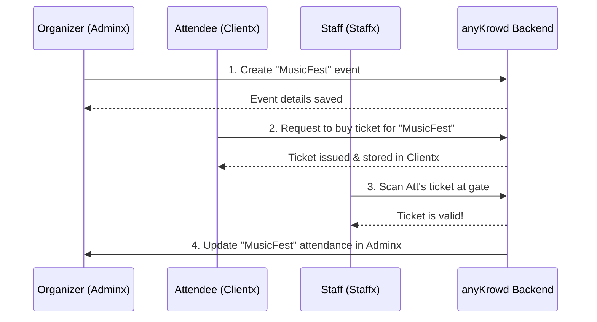

# Chapter 1: anyKrowd Platform Architecture

Welcome to the anyKrowd tutorial series! We're excited to help you understand how anyKrowd works, starting with the big picture.

Imagine you're tasked with organizing a large music festival. You need to sell tickets, manage who gets in, ensure your staff on the ground can handle entry and sales, and provide attendees with a smooth experience. Juggling all these tasks can feel overwhelming! How can you make sure everything runs like a well-oiled machine?

This is where the **anyKrowd Platform Architecture** comes in. It's designed to break down the complexity of event management into manageable, interconnected parts. Think of it as the blueprint for your event's success.

## The Three-Ring Circus: Adminx, Staffx, and Clientx

At the heart of anyKrowd are three main applications, each designed for a specific group of users. We like to think of it as a three-ring circus:

1.  **Adminx (The Ringleader's Tent):** This is where the event organizers, like you, plan and manage the entire show.
2.  **Staffx (The Crew's Backstage):** This is the tool for your on-site staff – the people managing the gates, selling merchandise, or serving drinks.
3.  **Clientx (The Audience's Ticket & Program):** This is the app for your attendees, making their event experience interactive and convenient.

Let's look at each one:

### 1. Adminx: The Ringleader's Command Center

Adminx is the powerful web-based platform for event organizers. If you're planning the festival, Adminx is your best friend.

*   **What it's for:** Setting up events, creating different ticket types (e.g., VIP, General Admission), managing sales, viewing real-time analytics (like how many people have arrived), and configuring all the nitty-gritty details of your event.
*   **Who uses it:** Event organizers, event managers, and anyone involved in the planning and oversight of the event.
*   **Think of it as:** The ringmaster's main office, where they plan every act, assign roles, and watch over the entire circus.

As described in our overview:
```
- **Adminx**: The backend management platform where organizers configure events, manage sales, track analytics, and control all operational aspects.
```
This is your central hub for all event-related decisions and configurations.

### 2. Staffx: The Crew's On-the-Ground Tool

Staffx is a mobile application designed for the event staff working on-site.

*   **What it's for:** Scanning tickets at the entrance, processing sales at food stalls or merchandise booths (perhaps using our [Digital Wallet System](04_digital_wallet_system_.md)), managing access to different areas, and generally handling operations on the event day.
*   **Who uses it:** Gate staff, security personnel, vendors, bar staff – anyone working directly with attendees and operations during the event.
*   **Think of it as:** The crew's toolkit. Each member has the specific tools they need to manage their part of the show, whether it's checking tickets at the main entrance or selling popcorn.

Again, from our core components:
```
- **Staffx**: The staff-facing application used for on-ground operations like checking tickets, processing sales, and managing event access.
```
Staffx empowers your team to be efficient and effective right where the action is.

### 3. Clientx: The Attendee's Digital Companion

Clientx is the application for your event attendees. It's their personal gateway to the event.

*   **What it's for:** Buying tickets, viewing their purchased tickets, accessing a [Digital Wallet System](04_digital_wallet_system_.md) for cashless payments, viewing event schedules, maps, and other important information.
*   **Who uses it:** Anyone attending your event.
*   **Think of it as:** The audience member's interactive ticket and event program. It’s how they get in, find their way around, and engage with the event.

Our overview highlights:
```
- **Clientx**: The attendee-facing app that enables users to manage tickets, digital wallets, and interact with event features.
```
Clientx is all about enhancing the attendee journey from start to finish.

## How They Work Together: A Seamless Event Experience

These three applications aren't isolated; they are designed to work together seamlessly. Let's revisit our music festival example:

1.  **Planning (Adminx):** You, the organizer, use **Adminx** to create the "MusicFest" event. You define ticket types (e.g., "Early Bird," "General Admission") and set their prices. You might also configure which food stalls accept cashless payments.

2.  **Ticket Purchase (Clientx):** An attendee, let's call her Sarah, hears about MusicFest. She opens the **Clientx** app on her phone, finds MusicFest, and buys a "General Admission" ticket. The ticket is now stored digitally in her app.

3.  **Event Day - Entry (Staffx & Clientx):** Sarah arrives at MusicFest. A staff member, Tom, is at the gate with the **Staffx** app on a handheld device. Sarah presents her digital ticket from her **Clientx** app. Tom scans it with **Staffx**. The system instantly checks if the ticket is valid.

4.  **Event Day - Purchases (Staffx & Clientx):** Inside, Sarah wants to buy a drink. The vendor uses **Staffx** as a point-of-sale system. Sarah might pay using a cashless wristband or her **Clientx** app, linked to the [Digital Wallet System](04_digital_wallet_system_.md) you configured in **Adminx**.

5.  **Monitoring (Adminx):** Throughout the day, you can log into **Adminx** and see real-time data: how many attendees like Sarah have entered, how ticket sales are going, and what the popular food items are.

This interconnectedness ensures that information flows smoothly, reducing errors and making the event enjoyable for everyone.

## A Peek Under the Hood: How Information Flows

You might be wondering how these separate applications "talk" to each other. They communicate through a central anyKrowd backend system (which includes databases and APIs). Think of this backend as the central switchboard or the brain of the operation.

When an organizer creates an event in Adminx, that information is stored in the central system. Clientx can then pull this event information to display to attendees, and Staffx can access it to validate tickets or process sales related to that event.

Here's a simplified diagram showing this interaction:



This diagram illustrates:
1.  The **Organizer (Adminx)** sets up the event in the **anyKrowd Backend**.
2.  The **Attendee (Clientx)** interacts with the **Backend** to purchase a ticket.
3.  The **Staff (Staffx)** uses the **Backend** to validate the attendee's ticket.
4.  The **Backend** updates the event data, which the **Organizer (Adminx)** can then view.

This central system ensures that Adminx, Staffx, and Clientx are always working with the most up-to-date information. This is a crucial part of what makes anyKrowd powerful – these aren't just three separate apps, but three faces of one integrated platform.

## Why This Architecture Matters

This three-part architecture (Adminx, Staffx, Clientx) offers several key benefits:

*   **Clarity and Focus:** Each application is tailored to the specific needs of its users. Organizers get powerful planning tools, staff get efficient operational tools, and attendees get a user-friendly experience.
*   **Efficiency:** By providing the right tools to the right people, tasks are performed more quickly and with fewer errors.
*   **Scalability:** This modular design allows anyKrowd to handle events of all sizes, from small gatherings to massive festivals.
*   **Improved Experience:** Ultimately, this structure leads to a smoother, more engaging, and professional experience for everyone involved – organizers, staff, and attendees.

## Conclusion

You've now had your first look at the anyKrowd Platform Architecture! You've learned about the "three-ring circus":
*   **Adminx:** For organizers to plan and manage.
*   **Staffx:** For on-site staff to operate efficiently.
*   **Clientx:** For attendees to engage and enjoy the event.

Understanding this fundamental structure is key to understanding how anyKrowd streamlines event management. Each component plays a vital role, and their collaboration is what makes the magic happen.

In the next chapter, we'll dive deeper into the first of these applications from an attendee's perspective.

Next up: [Clientx Application Core](02_clientx_application_core_.md)

---

Generated by [AI Codebase Knowledge Builder](https://github.com/The-Pocket/Tutorial-Codebase-Knowledge)