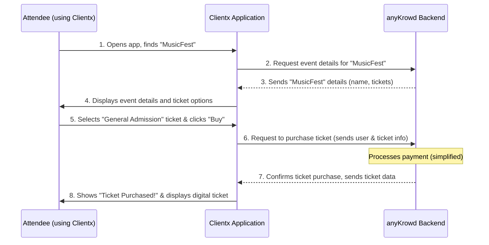

# Chapter 2: Clientx Application Core

Welcome to Chapter 2! In our [previous chapter, "anyKrowd Platform Architecture"](01_anykrowd_platform_architecture_.md), we got a bird's-eye view of how anyKrowd is structured, introducing the three main applications: Adminx, Staffx, and Clientx. We learned that Clientx is the app for your event attendees.

Now, let's zoom in and explore the **Clientx Application Core**.

Imagine you're Sarah, an excited music fan who just heard about "MusicFest," the coolest festival of the year. How do you get your ticket? How do you find out who's playing when? And once you're at the festival, how do you buy that cool band t-shirt without fumbling for cash? This is where Clientx shines!

Clientx is designed to be the event-goer's **digital passport and personal concierge**. It’s the application attendees like Sarah will use on their phones or computers to interact with your event.

## What is Clientx? Your Attendee's Best Friend

Clientx is the part of anyKrowd that your attendees will see and use directly. Think of it as their all-in-one event companion. Its main jobs are to:

1.  **Manage Tickets:** Attendees can browse events, buy tickets, and then easily access their digital tickets for entry. No more lost paper tickets!
2.  **Handle Digital Wallets:** For events that use cashless payments, Clientx allows attendees to load funds into their digital wallet and make purchases with a tap of their phone or a wristband. (We'll dive deeper into this in the [Digital Wallet System](04_digital_wallet_system_.md) chapter).
3.  **Provide Event Information:** Attendees can find event schedules, maps, artist information, and other important updates.
4.  **Enable Interaction:** Depending on the event, Clientx might offer features like voting in polls, participating in quizzes, or even internal chat.

Clientx is typically available as a **Progressive Web App (PWA)**. This is a fancy way of saying it's a website that behaves like an app. Users can access it through their web browser (like Chrome or Safari) on any device, and they can often "install" it to their home screen for quick access, just like a native app. Sometimes, native app versions (downloaded from app stores) might also be available.

The anyKrowd project actually contains two versions of Clientx: one built with Angular/Ionic and another with Vue.js. Think of these as two different toolkits to build the same great experience for the attendee. For the purpose of this tutorial, the specific technology doesn't change what Clientx *does* for the user.

Let's follow Sarah's journey with MusicFest to see Clientx in action.

## Sarah's Journey with Clientx

1.  **Discovering MusicFest & Buying a Ticket:**
    *   Sarah hears about MusicFest and visits its website. There's a prominent "Get Tickets" button.
    *   Clicking it might open the Clientx PWA directly in her browser.
    *   She sees MusicFest listed, selects her preferred ticket type (e.g., "General Admission"), and proceeds to a secure checkout.
    *   After payment, her ticket is digitally stored in her Clientx account.

2.  **Accessing Her Ticket:**
    *   On the day of the festival, Sarah opens Clientx on her phone.
    *   She navigates to "My Tickets" and sees her MusicFest ticket, likely with a QR code.
    *   At the gate, a staff member (using the Staffx app, which we'll cover in [Chapter 3: Staffx Application Core](03_staffx_application_core_.md)) scans her QR code, and she's in!

3.  **During the Event:**
    *   Inside, Sarah uses Clientx to check the performance schedule to see when her favorite band is playing.
    *   She wants to buy a t-shirt. The vendor uses a cashless system. Sarah uses her Clientx app, linked to her [Digital Wallet System](04_digital_wallet_system_.md), to pay.

Clientx aims to make Sarah's entire event experience smooth, convenient, and engaging.

## Key Features Under the Hood (A Glimpse)

While Sarah is enjoying the user-friendly interface, a lot is happening behind the scenes. Clientx needs to:

*   **Talk to the anyKrowd Backend:** To get event information, process ticket purchases, validate tickets, and update wallet balances, Clientx communicates with the central anyKrowd system (which uses [APIX (External API)](07_apix__external_api_.md)).
*   **Manage User Sessions:** It needs to know who Sarah is, so it uses the [Authentication & Authorization System](05_authentication___authorization_system_.md) to log her in and keep her session secure.
*   **Store Data (Sometimes Locally):** As a PWA, Clientx can sometimes store some data locally on Sarah's device, like her ticket, so she can access it even if her internet connection is spotty.
*   **Adapt to the Event:** Clientx can be configured differently for each event (tenant). For MusicFest, it might show band lineups, while for a business conference, it might show speaker bios and session tracks. This is part of the [Tenant Configuration](09_tenant_configuration_.md).

### How Clientx Gets Information

When Sarah opens Clientx and searches for MusicFest, the app doesn't magically know about it. It sends a request to the anyKrowd backend.

Here's a simplified idea of how Clientx (Vue version, for example) might ask for event data using its API helper:

```typescript
// Simplified example from clientx-vue/src/api/anykrowdApi.ts
// This function would be used to GET data from a specific URL
// like '/events' or '/events/musicfest-id'

// anykrowdApi.get(url, needsAuthentication, config)
async function getEventDetails(eventId: string) {
  // The actual URL would be something like 'https://api.anykrowd.com/v1/events/musicfest-id'
  const response = await anykrowdApi.get(`/events/${eventId}`);
  return response.data; // This would contain event details
}
```
This snippet shows a function `getEventDetails`. When called with an event ID (like "musicfest-id"), it uses `anykrowdApi.get` to send a request to the backend API. The `response.data` would then contain the information about MusicFest, like its name, date, and ticket types. Clientx then displays this information to Sarah.

### Keeping Things Organized: The App Component

Both the Angular and Vue versions of Clientx have a main "root" or "app" component. This is like the main conductor of an orchestra, setting up the basic structure and services the app needs to run.

For example, in the Angular version (`clientx/src/app/app.component.ts`), part of its job is to load initial configurations:

```typescript
// Simplified snippet from clientx/src/app/app.component.ts
// Focus on the idea, not the exact syntax

export class AppComponent implements OnInit {
  // ... other properties

  constructor(private configService: ConfigService, /*...other services */) {}

  async ngOnInit() {
    // Fetch tenant-specific configuration when the app starts
    await this.getConfiguration();
    // ... other initialization
  }

  async getConfiguration() {
    this.configService.getTenantConfiguration().subscribe(config => {
      // Store this configuration to customize the app
      this.setTenantConfig(config);
    });
  }

  // ... other methods
}
```
This code shows that when the app starts (`ngOnInit`), it calls `getConfiguration`. This function, in turn, uses a `configService` to fetch details specific to the event or organizer (the "tenant"). This configuration might include colors, logos, and which features are enabled, making Clientx look and feel right for MusicFest.

## How Clientx Talks to the Backend: A Simple Flow

Let's visualize Sarah buying a ticket:



1.  Sarah uses the Clientx interface.
2.  **Clientx App** makes a request to the **anyKrowd Backend** for event information.
3.  The **Backend** sends back the details (like those defined in [Core Data Models](06_core_data_models_.md)).
4.  **Clientx App** shows these details to Sarah.
5.  Sarah initiates a purchase.
6.  **Clientx App** sends the purchase request (including user details from the [Authentication & Authorization System](05_authentication___authorization_system_.md)) to the **Backend**.
7.  The **Backend** processes this (handles payment integration, creates the ticket record) and sends a confirmation and the digital ticket data back.
8.  **Clientx App** updates to show Sarah her new ticket.

This constant communication ensures that what Sarah sees and does in Clientx is always in sync with the main event data managed by the organizer in Adminx.

## Conclusion

You've now had a closer look at the **Clientx Application Core**, the digital companion for every event attendee. It's the friendly face of anyKrowd that helps users like Sarah manage their tickets, access event information, and interact with your event seamlessly, whether it's built with Angular/Ionic or Vue.

Clientx is all about enhancing the attendee experience, making it smoother, more convenient, and more engaging. It acts as their digital passport, opening up the world of your event right from their pocket.

In the next chapter, we'll switch gears and look at the tools for your on-ground team.

Next up: [Staffx Application Core](03_staffx_application_core_.md)

---

Generated by [AI Codebase Knowledge Builder](https://github.com/The-Pocket/Tutorial-Codebase-Knowledge)