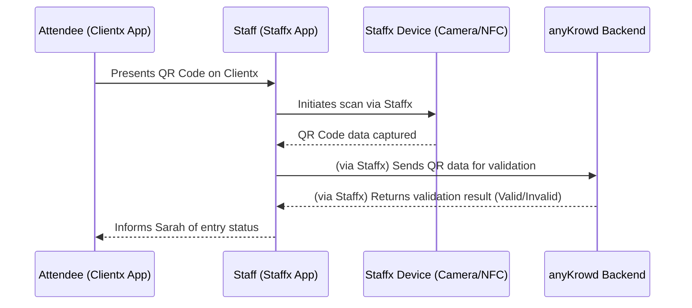

# Chapter 3: Staffx Application Core

Welcome to Chapter 3! In the [previous chapter, "Clientx Application Core"](02_clientx_application_core_.md), we explored the application attendees use to interact with your event. Now, let's switch gears and look at the tools designed for your on-the-ground team: the **Staffx Application Core**.

Imagine MusicFest is in full swing! Attendees are arriving, and your staff need to efficiently check tickets, manage entry, and perhaps even handle sales at merchandise booths. How can they do all this quickly and without confusion, especially when there's a long queue of excited fans? This is where Staffx comes to the rescue!

## Meet Tom: Your Event Staff on the Front Line

Let's introduce Tom. Tom is part of the event staff at MusicFest, and his primary job today is to scan tickets at the main entrance. He needs a reliable, fast, and easy-to-use tool to make sure only valid ticket holders get in.

Staffx is precisely that tool for Tom and all other event staff. It's their **digital multi-tool**, empowering them to perform their duties effectively.

## What is Staffx? The Crew's Super-Powered Helper

As we learned in [Chapter 1: anyKrowd Platform Architecture](01_anykrowd_platform_architecture_.md), Staffx is the mobile application specifically built for event staff. Think of it as the command center for everyone working on-site.

*   **It's a Mobile App:** Staffx is designed to run on mobile devices (like smartphones or specialized handheld terminals) that staff can easily carry around.
*   **Built with Web Technologies:** It's primarily built using **Angular** (a framework for building applications) and **Ionic** (a toolkit for creating mobile app experiences with web technologies). This means it can look and feel like a native app.
*   **Accesses Device Features with Capacitor:** To do things like scan QR codes with the camera or read NFC tags, Staffx uses **Capacitor**. Capacitor is like a bridge that allows a web-based app to use the native features of a phone or tablet. We'll touch more on specialized hardware interactions in [Chapter 10: Staffx Capacitor Plugins](10_staffx_capacitor_plugins_.md).

As the `staffx/README.md` mentions:
> Staff X is an Android application built with the Ionic Framework... StaffX provides following features per event: Access control, Sales, Order flow, Top up client, Activity log.

This tells us Staffx is feature-rich and ready for various on-site tasks.

## Key Functions of Staffx: Tom's Toolkit

Staffx equips your team with several crucial capabilities:

1.  **Ticket Scanning (QR Codes & NFC):** This is Tom's main task. Attendees present their tickets (digital ones from Clientx, or even physical ones with QR codes). Tom uses Staffx to scan them and instantly verify if they're valid.
2.  **Point-of-Sale (POS) Transactions:** If Tom were working at a merchandise stall, he could use Staffx to process sales, perhaps accepting payments via the [Digital Wallet System](04_digital_wallet_system_.md).
3.  **Digital Wallet Top-ups:** For events using cashless systems, staff can use Staffx to help attendees add funds to their digital wallets.
4.  **Managing Event Access:** Staffx can control access to different zones within an event (e.g., VIP areas, backstage).
5.  **Activity Logging:** It keeps a record of actions, which is useful for reporting and troubleshooting.

## How Staffx Helps Tom Scan Tickets

Let's get back to Tom at the MusicFest entrance. An attendee, Sarah, arrives with her ticket displayed as a QR code on her Clientx app.

1.  **Login:** Tom has already logged into the Staffx app on his handheld device. This login is secured by the [Authentication & Authorization System](05_authentication___authorization_system_.md), ensuring only authorized staff can use it.
2.  **Event Context:** Staffx knows it's being used for "MusicFest" because of the [Tenant Configuration](09_tenant_configuration_.md) that was set up in Adminx. This means it's looking for MusicFest tickets.
3.  **Selects "Access Control":** Tom navigates the Staffx menu to the "Access Control" or ticket scanning feature. The menu structure might look something like what's defined in `staffx/src/app/core/config/app-menu-items-config.ts`:

    ```typescript
    // Simplified from staffx/src/app/core/config/app-menu-items-config.ts
    {
        icon: 'assets/icon/ticket-outline.svg', // An icon for the menu
        name: 'menu.access_control.title',     // "Access Control"
        route: CustomRoutes._routes.accessControl, // Where to go in the app
        requiredRights: ['access_manager'],    // Tom needs this permission
    },
    ```
    This configuration ensures that the "Access Control" option is available to Tom if he has the `access_manager` right.

4.  **Scans QR Code:** Tom points his device's camera at Sarah's QR code. Staffx, using Capacitor to access the camera, reads the QR code.
5.  **Validation:** Staffx sends the QR code data to the anyKrowd backend via [APIX (External API)](07_apix__external_api_.md). The backend checks if the ticket is valid for MusicFest.
6.  **Result:** Staffx displays the result on Tom's screen: "VALID - Sarah Welcome!" or "INVALID - Ticket Not Recognized."

This entire process happens in just a few seconds!

## Under the Hood: A Glimpse into Staffx's Operations

How does Staffx make all this happen? Let's look at a simplified flow and some key code components.

### The Ticket Scanning Flow

Here's a simplified sequence of what happens when Tom scans Sarah's ticket:



1.  Sarah shows her QR code.
2.  Tom uses Staffx, which tells the device's hardware (camera) to scan.
3.  The device captures the QR code data and gives it back to the Staffx app.
4.  Staffx sends this data to the anyKrowd Backend.
5.  The Backend checks the ticket's validity (using data like that from [Core Data Models](06_core_data_models_.md)) and sends a response.
6.  Staffx shows Tom the result, and Tom lets Sarah know.

### Key Code Components in Staffx

**1. The Main Application Component (`app.component.ts`)**

This is the heart of the Staffx application, responsible for initial setup. When Staffx starts, it needs to get ready to work.

```typescript
// Simplified from staffx/src/app/app.component.ts
export class AppComponent implements OnInit {
    constructor(
        private platform: Platform, // Ionic's platform service
        private authService: AuthService, // For login status
        // ... other services
    ) {}

    async ngOnInit() {
        await this.initializeApp(); // Call to set up the app
        // ...
        // Check if user is logged in
        this.isAuthenticated = await this.authService.isAuthenticated();
        if (this.isAuthenticated) {
            // If logged in, load user details and settings
            await this.loadTenantSettings(); // Event-specific settings
            await this.getUserProfile();    // Staff member's details
        }
    }

    initializeApp() {
        this.platform.ready().then(async () => { // Wait for device to be ready
            await SplashScreen.hide(); // Hide the app's loading screen
            this.setupHardwareListeners(); // Prepare for scanning
        });
    }

    setupHardwareListeners() {
        // Example for a generic QR scanner using Capacitor
        if (Capacitor.isNativePlatform()) {
            // Listen for QR codes from a built-in scanner plugin
            // (Actual plugin like 'SunmiScanner' is used in the real app)
            // SomeScannerPlugin.addListener('onScan', ({ qrCode }) => {
            //   this.events.publish('qrCodeScanned', qrCode);
            // });
        }
    }
    // ... other methods like loadTenantSettings, getUserProfile
}
```
*   `ngOnInit()`: This function runs when the app component is first loaded. It calls `initializeApp()`.
*   `initializeApp()`: Waits for the mobile platform to be ready (e.g., all device features accessible) and then hides the initial splash screen. It also calls `setupHardwareListeners()`.
*   `setupHardwareListeners()`: This is where Staffx would prepare to listen for scans from the device's camera (for QR codes) or NFC reader. The actual code in `app.component.ts` shows setup for `NFC` and `SunmiScanner` (a specific hardware plugin detailed in [Chapter 10: Staffx Capacitor Plugins](10_staffx_capacitor_plugins_.md)).

**2. Talking to the Backend (`api.service.ts`)**

When Tom scans a ticket, Staffx needs to send the scanned data (e.g., "QR123XYZ") to the anyKrowd backend to check its validity. This communication is handled by services like `ApiService`.

```typescript
// Simplified concept from staffx/src/app/core/services/api.service.ts
@Injectable({ providedIn: 'root' })
export class ApiService {
    // ... (constructor and other methods)

    // A generic way to send data (POST request)
    public post<ResponseType>(url: string, data: any): Observable<ResponseType> {
        // 'request' handles adding authentication tokens, actual sending, etc.
        return this.request<ResponseType>({
            url: url,            // e.g., '/tickets/validate'
            method: 'post',
            data: data,          // e.g., { qr_code: 'QR123XYZ' }
            authNeeded: true     // This request needs user to be logged in
        }).pipe(map(response => response?.body)); // Get the main data from response
    }
}
```
*   The `post` method is a simplified example. It takes a URL (like `/api/v1/tickets/validate`), the data to send (like the QR code), and sends it to the backend.
*   The actual `request` method within `ApiService` is more complex; it handles things like adding authentication headers (so the backend knows Tom is a logged-in staff member) and even caching strategies to make the app faster.
*   A service responsible for ticket validation would use this `ApiService` like so:

    ```typescript
    // In a hypothetical TicketValidationService
    // constructor(private apiService: ApiService) {}

    async validateTicket(qrData: string): Promise<ValidationResult> {
        const endpoint = '/tickets/validate'; // API endpoint for validation
        try {
            // Send { qr_code: "QR123XYZ" } to the backend
            const result = await this.apiService.post<ValidationResult>(endpoint, { qr_code: qrData }).toPromise();
            return result; // e.g., { isValid: true, message: "Welcome!" }
        } catch (error) {
            // Handle errors, e.g., network issue or invalid ticket format
            return { isValid: false, message: "Error validating ticket." };
        }
    }
    ```
    This `validateTicket` function uses the `ApiService` to send the scanned QR data. The backend then responds, and Staffx updates Tom's screen.

**3. Specialized Hardware Integration (e.g., SunmiScanner)**

The `staffx/README.md` mentions, "Staff X will only be available on Sunmi Devices." Sunmi devices are specialized Android handhelds often used for POS and scanning. Staffx integrates with their built-in scanners using custom [Staffx Capacitor Plugins](10_staffx_capacitor_plugins_.md).

In `app.component.ts`, you see this kind of integration:
```typescript
// Simplified from app.component.ts
import SunmiScanner from 'src/app/core/plugins/sunmi_scanner/sunmi_scanner.plugin';
// ...
initializeApp() {
    this.platform.ready().then(async () => {
        // ...
        if(Capacitor.isNativePlatform()) { // Check if running as a native app
            SunmiScanner.addListener('onScan', ({ qrCode }) => {
                // This function is called when the Sunmi device's scanner gets a QR code
                this.events.publish(ValuesEnum.eventIRQrCodeScanned, qrCode);
            });
        }
    });
}
```
*   `SunmiScanner.addListener('onScan', ...)`: This line tells the Staffx app to "listen" for scan events from the Sunmi device's hardware scanner.
*   When a scan happens, the `qrCode` is received, and an internal app event `eventIRQrCodeScanned` is published. Other parts of the app (like the access control screen) listen for this event to process the scanned code.

This shows how Staffx adapts to use the best available scanning method on the device it's running on.

## Conclusion

The **Staffx Application Core** is the powerhouse for your event staff. It's a versatile mobile application built with Angular, Ionic, and Capacitor, designed to streamline on-ground operations like ticket scanning, sales, and access management. By providing an intuitive interface and direct integration with device hardware (sometimes specialized, like Sunmi scanners), Staffx empowers your team to be efficient and effective, ensuring a smooth experience for attendees.

For Tom at the MusicFest gate, Staffx means he can quickly and accurately check tickets, keeping lines moving and attendees happy. It's his reliable partner for a successful event day.

In the next chapter, we'll explore a system that's crucial for both Clientx and Staffx when it comes to cashless operations.

Next up: [Digital Wallet System](04_digital_wallet_system_.md)

---

Generated by [AI Codebase Knowledge Builder](https://github.com/The-Pocket/Tutorial-Codebase-Knowledge)