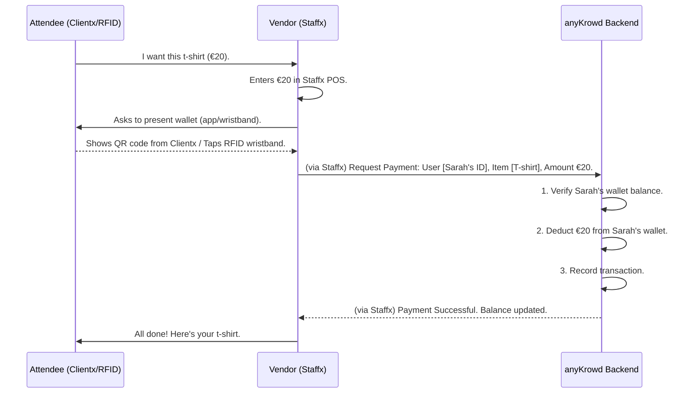

# Chapter 4: Digital Wallet System

Welcome to Chapter 4! In the [previous chapter, "Staffx Application Core"](03_staffx_application_core_.md), we learned how the Staffx app empowers your on-site event team. Now, let's dive into a feature that often works hand-in-hand with both Staffx and [Clientx Application Core](02_clientx_application_core_.md): the **Digital Wallet System**.

Imagine you're at MusicFest. You want to buy a cool band t-shirt or grab a quick snack. Fumbling for cash or waiting for slow credit card machines can be a hassle, especially in a crowded, fast-paced environment. How can we make payments super smooth and quick for everyone?

This is exactly what the **Digital Wallet System** in anyKrowd is designed to solve!

## What's a Digital Wallet System? Your Event's Own Money!

The Digital Wallet System is a core feature of anyKrowd. It's a **closed-loop payment system**, which means it's designed for making cashless transactions *within* your event.

Think of it like this:
*   **Festival Tokens:** Many festivals give you tokens you buy with real money, and then you use those tokens to pay for food and drinks.
*   **Casino Chips:** In a casino, you exchange money for chips, and then use chips to play games.

The anyKrowd Digital Wallet System is similar, but it's all electronic! It's like having an **event-specific digital currency**. Attendees load real money into their digital wallets, and then they use these digital wallets to pay for things like food, drinks, and merchandise at your event.

This system can be:
*   **App-based:** Attendees use their [Clientx Application Core](02_clientx_application_core_.md) on their smartphones to manage their wallet and make payments (e.g., by showing a QR code).
*   **RFID-based:** Attendees might get a wristband with an RFID chip. They load funds onto the wristband, and then simply tap it at payment points.

The sales points (like food stalls or merchandise booths) are managed by your staff using the [Staffx Application Core](03_staffx_application_core_.md).

## How Does It Work? A Cashless Day at MusicFest

Let's follow Sarah, our MusicFest attendee, as she uses the Digital Wallet System.

**1. Loading Funds (Topping Up):**

Before or during the festival, Sarah needs to add money to her event wallet.
*   **Option A: Through Clientx (Self-Service):**
    Sarah opens her Clientx app, goes to the "Wallet" section, and chooses to "Top Up." She might add €50 using her credit card. This €50 is now available as "MusicFest Credits" in her digital wallet.
*   **Option B: With Staffx (Assisted Top-Up):**
    Sarah goes to a "Top-Up Station" at the festival. She gives a staff member, Tom, €50 in cash. Tom uses his Staffx app to find Sarah's account (or link the funds to her RFID wristband) and adds the €50 to her digital wallet.

**2. Buying a T-Shirt (Making a Payment):**

Sarah finds a t-shirt she loves at a merchandise booth. It costs €20.
*   The vendor uses the [Staffx Application Core](03_staffx_application_core_.md) on a tablet or handheld device, which acts as a Point-of-Sale (POS) system.
*   The vendor rings up €20.
*   Sarah either:
    *   Presents a QR code from her Clientx app for the vendor to scan.
    *   Taps her RFID wristband on a reader connected to the Staffx device.
*   The Staffx app securely communicates with the anyKrowD backend. €20 in "MusicFest Credits" are deducted from Sarah's wallet.
*   The Staffx app shows "Payment Successful!"
*   Sarah gets her t-shirt, and no physical cash changed hands!

**3. Checking Her Balance:**

At any time, Sarah can open her Clientx app and see how much "MusicFest Credit" she has left.

## Why Use a Digital Wallet?

*   **Speed:** Tapping a wristband or scanning a QR code is much faster than handling cash or waiting for card approvals.
*   **Convenience:** Attendees don't need to carry lots of cash.
*   **Security:** Reduces cash handling for vendors, lowering risks.
*   **Data & Insights:** Event organizers (using Adminx) can get valuable data on what's being sold, popular items, and peak sales times. This is part of [Embeddable Analytics (Cube.js Data Models)](08_embeddable_analytics__cube_js_data_models_.md).
*   **Reduced Queues:** Faster transactions mean shorter lines!

## Under the Hood: The Flow of Digital Money

Let's simplify how a payment works using a sequence diagram:



1.  Sarah wants to buy something.
2.  The Vendor, using **Staffx**, initiates the sale.
3.  Sarah presents her digital wallet (via Clientx app or RFID).
4.  **Staffx** sends the transaction details to the **anyKrowd Backend**.
5.  The **Backend** checks Sarah's wallet, deducts the amount, and records everything. This involves interactions with [Core Data Models](06_core_data_models_.md) for wallets and transactions.
6.  The **Backend** confirms success to **Staffx**.
7.  The sale is complete!

## A Peek at the Code: Wallet Operations

Let's look at how different parts of anyKrowd interact with the digital wallet concept.

### Clientx: Managing Your Own Wallet

Attendees primarily use Clientx to manage their wallets.

**1. Checking Current Balance (Clientx - Angular version):**
The `WalletService` in Clientx helps fetch the current balance.

```typescript
// Simplified from clientx/src/app/core/services/wallet.service.ts
export class WalletService {
  constructor(public api: ApiService) {} // ApiService talks to the backend

  getCurrentBalance(): Observable<CurrentBalance> {
    const url = `${window.apiUrl}/wallet/current-balance`; // Backend endpoint
    // 'this.api.request' makes a GET request to the backend
    return this.api.request<any, CurrentBalance>({ url, method: 'get' })
      .pipe(map(response => response.body)); // Returns the balance data
  }
}
```
This code defines a function `getCurrentBalance`. When called, it uses an `ApiService` to ask the anyKrowd backend for the user's current wallet balance. The backend would then return data looking something like this (simplified from `clientx/src/app/core/models/Balance.ts`):

```typescript
// Simplified idea of what CurrentBalance data might hold
export class CurrentBalance {
  current_balance: string; // e.g., "30.00"
  // ... other info like currency
}
```

**2. Topping Up Funds (Clientx - Angular version):**
Clientx also has functions to initiate a top-up.

```typescript
// Simplified from clientx/src/app/core/services/wallet.service.ts
export class WalletService {
  // ... (constructor and other methods)

  topUp(data: { amount: string; redirectUrl: string }): Observable<{ redirectUrl: string }> {
    const url = `${window.apiUrl}/wallet/top-up`; // Backend endpoint for top-up
    // 'this.api.post' sends data (amount, etc.) to the backend
    return this.api.post<{ redirectUrl: string }>(url, data);
    // Backend processes payment (e.g., via credit card) & returns a URL
  }
}
```
Here, `topUp` sends the desired amount and a `redirectUrl` (where the user goes after payment) to the backend. The backend handles the actual payment processing with a payment gateway and then credits the user's digital wallet.

### Staffx: Assisting with Wallets and Processing Sales

Staff members use Staffx to help attendees top up or to process sales using the digital wallet.

**1. Staff-Assisted Top-Up (Staffx):**
The `WalletService` in Staffx allows staff to add funds to a user's wallet.

```typescript
// Simplified from staffx/src/app/core/services/wallet.service.ts
export class WalletService {
  constructor(public api: ApiService) {} // ApiService talks to the backend

  public topUp(data: TopUp): Observable<{ balance: string }> {
    const url = `${environment.apiUrl}/wallet/top-up`; // Backend endpoint
    // 'this.api.post' sends top-up details (who, how much) to the backend
    return this.api.post<any>(url, data).pipe(map((result) => result));
  }
}
```
This `topUp` function is similar to the Clientx one but is initiated by staff. The `data` object (of type `TopUp` from `staffx/src/app/core/models/Wallet.ts`) would contain information like the amount, payment type (cash/card), and the user's identifier (e.g., RFID tag or QR code).

A simplified `Wallet` data model in Staffx might look like this:
```typescript
// Simplified from staffx/src/app/core/models/Wallet.ts
export class Wallet {
  constructor(
    public id: number, // Wallet's unique ID
    public current_balance: string, // e.g., "50.00"
    public rfid_tags: any[], // Associated RFID tags
    // ... other user details
  ) {}
}
```
When a staff member processes a sale, Staffx communicates with the backend to debit the correct amount from the identified wallet.

### APIX: External Wallet Operations

Sometimes, other systems might need to interact with anyKrowd wallets. This is where [APIX (External API)](07_apix__external_api__.md) comes in.

For instance, an external partner system might want to top up a user's wallet. They could use an endpoint like this (from the `apix-documentation.md`):

**Endpoint:** `/apix/v1/users/topup`
**Method:** `POST`
**Description:** TopUp a user based on their external ID.
**Example Payload:**
```json
{
    "external_id": "user123", // User's ID in the external system
    "currency_id": 1,         // ID for the currency (e.g., "MusicFest Credits")
    "amount": 25.50           // Amount to add
}
```
When this API endpoint receives such a request (with proper [Authentication & Authorization System](05_authentication___authorization_system_.md)), the anyKrowd backend will credit the specified user's wallet with 25.50 units of the given currency.

APIX also offers endpoints to view wallet details and transaction history, for example:
*   `GET /apix/v1/wallets/show/{id}`: To get details of a specific wallet.
*   `GET /apix/v1/wallets/transactions/{id}`: To get a list of all transactions for a wallet.

These APIs allow for powerful integrations and automation related to the Digital Wallet System.

## RFID vs. App-Based

*   **RFID (Radio-Frequency Identification):**
    *   Usually involves a physical item like a wristband or card.
    *   Attendees tap their item to pay.
    *   Great for situations where phones might be inconvenient (e.g., water parks, very crowded areas) or for users without smartphones.
    *   The RFID tag's unique ID is linked to the user's digital wallet in the anyKrowd backend.
*   **App-Based (Clientx):**
    *   Attendees use the Clientx app on their phone.
    *   Payments often involve displaying a QR code that Staffx scans.
    *   Allows users to manage their wallet, see transaction history, and top up directly from their phone.

anyKrowd can support either or even a mix, depending on the event's needs, configured via Adminx as part of the [Tenant Configuration](09_tenant_configuration_.md).

## Conclusion

The **Digital Wallet System** is a powerful feature in anyKrowd that revolutionizes how payments are handled at events. By creating an event-specific digital currency, it offers faster transactions, enhanced convenience for attendees, and better control and insights for organizers.

Whether it's app-based through [Clientx Application Core](02_clientx_application_core_.md) or uses RFID technology, and whether it's managed by attendees themselves or assisted by staff using [Staffx Application Core](03_staffx_application_core_.md), the goal is the same: a seamless, cashless experience. This system relies on secure communication with the anyKrowd backend and careful management of wallet balances and transactions.

Understanding this system is key to seeing how anyKrowd modernizes event commerce. In the next chapter, we'll explore the critical system that keeps all these interactions secure.

Next up: [Authentication & Authorization System](05_authentication___authorization_system_.md)

---

Generated by [AI Codebase Knowledge Builder](https://github.com/The-Pocket/Tutorial-Codebase-Knowledge)