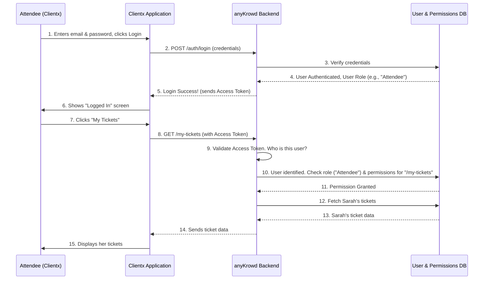

# Chapter 5: Authentication & Authorization System

Welcome to Chapter 5! In our [previous chapter, "Digital Wallet System"](04_digital_wallet_system_.md), we explored how attendees and staff can manage and use digital funds for cashless transactions at events. But how does the system know it's really Sarah accessing *her* wallet? And how does it ensure that only staff member Tom can process payments, while an attendee can't? This is where our "security guards" step in: the **Authentication & Authorization System**.

Imagine your event is like an exclusive club. First, you need to show your ID at the door to prove who you are – that's **Authentication**. Once you're inside, your special wristband (General Access, VIP, Staff) determines which areas you can go into and what you can do – that's **Authorization**.

This system is crucial for keeping anyKrowd secure and ensuring everyone only sees and does what they're supposed to.

## What Problem Does This Solve? Knowing Who's Who and What They Can Do

Let's think about our MusicFest example:

*   **Sarah (Attendee):** She wants to log into the [Clientx Application Core](02_clientx_application_core_.md) to see her tickets and her [Digital Wallet System](04_digital_wallet_system_.md) balance. The system needs to verify it's really Sarah and then only show *her* information.
*   **Tom (Staff):** He needs to log into the [Staffx Application Core](03_staffx_application_core_.md) to scan tickets. The system needs to confirm Tom is authorized staff and then allow him to use the ticket scanning feature.
*   **Event Organizer (Admin):** They use Adminx to set up the event, define ticket prices, and view sales reports. They need powerful access, but we wouldn't want an attendee to accidentally change event details!
*   **External Partner System:** Perhaps a partner company needs to sync employee data to create staff accounts for Staffx via [APIX (External API)](07_apix__external_api_.md). The system needs a secure way for this partner system to identify itself and only perform allowed actions.

Without a robust Authentication and Authorization system, it would be chaos! Anyone could pretend to be anyone else, or access sensitive information and features.

## The Two Guards: Authentication vs. Authorization

This system has two main parts:

1.  **Authentication ("Who are you?"):** This is the process of proving your identity.
    *   For users (attendees, staff, admins) logging into apps like Clientx or Staffx, this usually means providing a username and password.
    *   For external systems or services interacting with [APIX (External API)](07_apix__external_api_.md), this often involves using a secret "API Key." Think of it as a special password for computer programs.

2.  **Authorization ("What are you allowed to do?"):** Once the system knows *who* you are, this process determines what actions you are permitted to perform.
    *   Are you allowed to view this page?
    *   Can you create a new ticket?
    *   Can you refund money from a digital wallet?
    This is usually managed through **roles** (e.g., "Attendee," "Cashier Staff," "Event Admin") and **permissions** (e.g., "can_scan_tickets," "can_view_reports").

As the concept description puts it:
> It's like a multi-layered security checkpoint. API keys are for trusted partners, user logins are for app users, and roles/permissions act as access badges defining which doors each user can open within the platform.

## How It Works in anyKrowd

Let's see how these concepts apply in the anyKrowd platform:

### 1. User Login (Authentication)

When Sarah, our attendee, wants to use the [Clientx Application Core](02_clientx_application_core_.md), she'll typically see a login screen.

*   She enters her email and password.
*   Clientx sends this information securely to the anyKrowd backend.
*   The backend checks if the email and password match a registered user.
*   If they match, Sarah is **authenticated**. The backend then usually gives Clientx a temporary "session token" (like a digital stamp on her hand). Clientx will include this token with future requests to prove Sarah is already logged in.

The `AuthService` in both Clientx and Staffx handles this. Here's a highly simplified idea of what a login function in `clientx/src/app/core/services/auth.service.ts` might do:

```typescript
// Simplified concept of a login function
// import { ApiService } from './api.service'; // For talking to backend
// import { UserLogin, UserToken } from '../models/User'; // Data structures

export class AuthService {
  // constructor(private api: ApiService) {}

  public login(credentials: UserLogin): Observable<UserToken> {
    const loginUrl = `${window.apiUrl}/auth/login`; // Backend login address
    // Send credentials to the backend
    // this.api.post() would handle the actual network request.
    // If successful, backend returns a token.
    // Store this token to keep user logged in.
    console.log(`Sending ${credentials.email} to ${loginUrl}`);
    // ... actual call to backend ...
    // return backendResponse;
  }
}
```
*   `credentials` would contain the email and password Sarah entered.
*   The function sends these to a specific backend URL.
*   If the login is successful, the backend responds with a `UserToken`, which includes the access token. Clientx stores this token to keep Sarah logged in for her session.

A similar process happens for Tom in Staffx.

### 2. API Key Authentication (For External Systems)

When an external system (like a partner's HR software) needs to communicate with anyKrowd via [APIX (External API)](07_apix__external_api_.md), it doesn't have a username and password. Instead, it uses an API key.

As seen in the `apix-documentation.md`:
> Authentication requires an API key (Bearer Token). ... To authenticate your requests, include the API key in the Authorization header:
> `curl -H "Authorization: Bearer YOUR_API_KEY" https://[tenantURL]/apix/v1/ping`

This `YOUR_API_KEY` is a secret code given to the partner system. When anyKrowd receives a request with a valid API key, it knows which system is making the request and that it's a trusted source.

### 3. Roles and Permissions (Authorization)

Once a user or system is authenticated, authorization kicks in.

*   **Sarah (Attendee):** After logging into Clientx, she is recognized as an "Attendee." Her role gives her permissions like "view_own_tickets," "manage_own_wallet," but *not* "edit_event_details."
*   **Tom (Staff):** After logging into Staffx, he might have the "Gate Scanner" role. This role has permissions like "scan_tickets" and "view_entry_logs," but perhaps not "process_sales" if he's not a cashier.
*   **Event Organizer (Admin):** They have an "Admin" role with broad permissions to manage everything within Adminx for their event.

These roles and permissions are usually defined in the Adminx application as part of [Tenant Configuration](09_tenant_configuration_.md) and stored in the backend. When a user tries to perform an action, the backend checks if their role has the necessary permission.

For example, in Staffx, the kinds of rights a staff member (admin user in Staffx context) might have are defined. A simplified view from `staffx/src/app/core/models/Admin.ts` shows various permissions:

```typescript
// Simplified from staffx/src/app/core/models/Admin.ts
export class AdminRights {
    access_manager = false; // Can they manage access control (scanning)?
    sales_manager = false;  // Can they manage sales?
    top_up = false;         // Can they top up digital wallets?
    // ... many other rights
}
```
When Tom logs in, Staffx receives his specific rights. If `access_manager` is `true`, the ticket scanning feature is enabled for him. If it's `false`, that feature might be hidden or disabled.

## Under the Hood: A Typical Interaction Flow

Let's visualize how authentication and authorization work together when Sarah tries to view her tickets after logging in:



**Explanation of the flow:**

1.  **Login (Authentication):**
    *   Sarah provides her credentials (1).
    *   Clientx sends them to the backend (2).
    *   The backend verifies them against the database (3-4).
    *   If valid, the backend sends back an **Access Token** (5). This token is like a temporary key card. Clientx stores it.

2.  **Accessing a Protected Resource (Authorization):**
    *   Sarah clicks "My Tickets" (7).
    *   Clientx sends a request to `/my-tickets` and includes the **Access Token** in the request headers (8).
    *   The backend first validates the token (9). If valid, it knows it's Sarah.
    *   Then, the backend checks if Sarah's role ("Attendee") has permission to access `/my-tickets` (10-11).
    *   If authorized, the backend fetches and returns her ticket data (12-14).
    *   If her token was invalid, or if her role didn't have permission, the backend would return an error (e.g., "Unauthorized" or "Forbidden").

This entire process ensures that only the right people can access the right information and features. The backend system, where Adminx also operates, is the central authority for this. (The `adminxcentralx/README.md` mentions "Laravel Sanctum" which is a popular system for handling API authentication and tokens in the backend.)

## Conclusion

The **Authentication & Authorization System** is the bedrock of security and proper access control within anyKrowd.
*   **Authentication** confirms "who you are" (using logins or API keys).
*   **Authorization** determines "what you can do" (based on roles and permissions).

This system ensures that attendees like Sarah can securely access their own data in [Clientx Application Core](02_clientx_application_core_.md), staff like Tom have the correct tools for their job in [Staffx Application Core](03_staffx_application_core_.md), organizers have full control in Adminx, and external systems can interact safely via [APIX (External API)](07_apix__external_api_.md). It's all about giving the right keys to the right people for the right doors.

With this understanding of how users and systems are identified and managed, we can now look at the information they work with.

Next up: [Core Data Models](06_core_data_models_.md)

---

Generated by [AI Codebase Knowledge Builder](https://github.com/The-Pocket/Tutorial-Codebase-Knowledge)