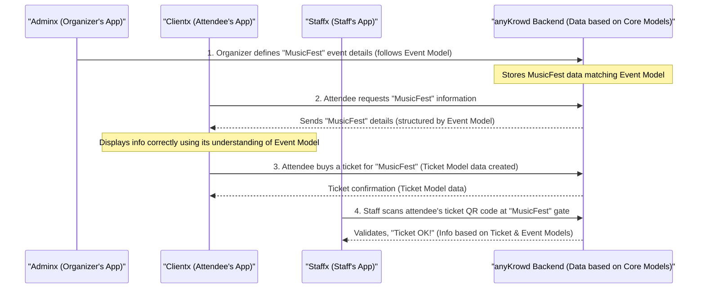

# Chapter 6: Core Data Models

Welcome to Chapter 6! In the [previous chapter, "Authentication & Authorization System"](05_authentication___authorization_system_.md), we learned how anyKrowd makes sure only the right people and systems can access information and perform actions. Now, let's talk about the *information itself*. How does everyone involved in an event—from organizers to attendees to staff—understand what an "Event" is, or what a "Ticket" contains?

This is where **Core Data Models** come into play.

## What Are Core Data Models? The "Blueprints" of Your Event

Imagine you're building a complex LEGO castle. You have different types of bricks: square ones, long ones, roof pieces, window pieces, and little LEGO people. To build the castle correctly, everyone on the team needs to agree on what each type of brick is and how it fits together. If one person thinks a "window piece" is actually a door, you'll have problems!

**Core Data Models are like the official design specifications or "blueprints" for the main LEGO pieces of your event.**

### The Problem: Speaking the Same Language

In a system like anyKrowd, many different parts need to work together:
*   **Adminx:** Where organizers set up events.
*   **Clientx:** Where attendees buy tickets and view event info.
*   **Staffx:** Where staff scan tickets and manage sales.
*   **Reporting Layer:** Where analysts look at data to see how the event performed.

If Adminx calls an event start time "EventBegin" and Clientx expects it as "StartTime," and Staffx calls it "KickOffTime," things will get very confusing very quickly! Data won't flow correctly, and the apps won't work together.

### The Solution: Core Data Models as Blueprints

Core Data Models are the fundamental data structures that represent the key things (we call them "entities") in anyKrowd. These include:
*   **Events:** The main occasion, like "MusicFest 2024".
*   **Users:** People interacting with the system, like attendees, staff, or organizers.
*   **Orders:** Records of purchases, like buying a ticket or a t-shirt.
*   **Products:** Items for sale, like "VIP Ticket" or "Band Hoodie".
*   **Tickets:** The actual passes that grant entry.
*   **Wallets:** Digital accounts for cashless payments.

These models define what information each entity holds and what that information means. They provide a **common language** that everyone (Adminx, Staffx, Clientx, and the reporting tools) uses. So, when we talk about an "Event," everyone understands it has a name, a start date, an end date, a location, etc., because the Event Data Model blueprint defines it that way.

## Meet the Main Blueprints: Our Key Data Models

Let's look at some of these "blueprints" in a very simplified way. Think of these as defining the main properties or characteristics of each component.

### 1. The Event Blueprint (Event Model)

This blueprint describes what an event is.
*   **What it is:** "MusicFest 2024," "Tech Conference NYC," "Local Farmers Market."
*   **Key Info it might hold:**
    *   `id`: A unique number for this event.
    *   `name`: The event's title (e.g., "MusicFest 2024").
    *   `start_datetime`: When the event begins.
    *   `end_datetime`: When the event ends.
    *   `location_address`: Where it's happening.
    *   `description`: A summary of the event.

```typescript
// Simplified Event Blueprint (conceptual)
class EventModel {
    id: number;
    name: string;
    start_datetime: Date;
    // ... and other important details
}
```
This tells every part of anyKrowd what to expect when dealing with an "Event."

### 2. The People Blueprint (User Model)

This blueprint describes a user of the system.
*   **Who it is:** Sarah (attendee), Tom (staff), John (organizer).
*   **Key Info it might hold:**
    *   `id`: A unique number for this user.
    *   `email`: Their email address (often used for login).
    *   `firstname`: Their first name.
    *   `lastname`: Their last name.

```typescript
// Simplified User Blueprint (conceptual)
class UserModel {
    id: number;
    email: string;
    firstname: string;
    // ... and other user profile details
}
```

### 3. The Purchase Blueprint (Order Model)

This blueprint describes a transaction or purchase.
*   **What it is:** Sarah buying 2 tickets for MusicFest, or Tom selling a t-shirt.
*   **Key Info it might hold:**
    *   `id`: A unique number for this order.
    *   `user_id`: Who made the purchase (links to a User).
    *   `total_price`: The total amount of the order.
    *   `status`: The state of the order (e.g., "paid," "pending," "refunded").
    *   `items`: A list of products or tickets in the order.

```typescript
// Simplified Order Blueprint (conceptual)
class OrderModel {
    id: number;
    user_id: number; // Links to a UserModel
    total_price: number;
    // ... and details of what was ordered
}
```

### 4. The Goods Blueprint (Product Model)

This blueprint describes an item that can be sold.
*   **What it is:** "General Admission Ticket," "VIP Pass," "Band T-Shirt," "Hot Dog."
*   **Key Info it might hold:**
    *   `id`: A unique number for this product.
    *   `name`: The product's name.
    *   `price`: How much it costs.
    *   `category`: What type of product it is (e.g., "Ticket," "Merchandise," "Food").

```typescript
// Simplified Product Blueprint (conceptual)
class ProductModel {
    id: number;
    name: string;
    price: number;
    // ... and other product details like description, stock
}
```

### 5. The Entry Pass Blueprint (Ticket Model)

This blueprint describes a specific ticket for an event.
*   **What it is:** Sarah's actual ticket to get into MusicFest.
*   **Key Info it might hold:**
    *   `id`: A unique number for this ticket.
    *   `event_id`: Which event this ticket is for (links to an Event).
    *   `user_id`: Who owns this ticket (links to a User).
    *   `qr_code`: A unique scannable code for entry.
    *   `ticket_type_name`: E.g., "VIP," "Early Bird."

```typescript
// Simplified Ticket Blueprint (conceptual)
class TicketModel {
    id: number;
    event_id: number; // Links to an EventModel
    user_id: number;  // Links to a UserModel
    qr_code: string;
    // ... and other ticket-specific details
}
```

### 6. The Money Pouch Blueprint (Wallet Model)

This blueprint describes a user's digital wallet for cashless payments.
*   **What it is:** Sarah's digital "MusicFest Credits."
*   **Key Info it might hold:**
    *   `id`: A unique number for this wallet.
    *   `user_id`: Who owns this wallet (links to a User).
    *   `balance`: The current amount of money in the wallet.
    *   `currency`: The type of credit (e.g., "EventCredits," "EUR").

```typescript
// Simplified Wallet Blueprint (conceptual)
class WalletModel {
    id: number;
    user_id: number; // Links to a UserModel
    balance: number;
    // ... and other wallet details like currency
}
```
These are just simplified examples. Real data models in anyKrowd hold much more detailed information, but this gives you the basic idea!

## How Everyone Uses the Same Blueprints

Because everyone refers to these same blueprints (Core Data Models), communication is smooth:

*   **Adminx: Designing the Event**
    When an organizer uses Adminx to create a new event, they are essentially filling in the fields defined by the "Event Model" blueprint. They provide the event's name, dates, location, ticket types (which are "Product Models"), etc. Adminx ensures this information is structured correctly according to the blueprints.

*   **Clientx: Viewing Event Info and Tickets**
    When Sarah opens the [Clientx Application Core](02_clientx_application_core_.md) to look for MusicFest, Clientx fetches event data from the anyKrowd backend. Because this data is structured according to the "Event Model" blueprint, Clientx knows how to display it correctly (e.g., where to find the event name, start time, description). When she buys a ticket, the ticket she sees in her app is also based on the "Ticket Model" blueprint.

*   **Staffx: Managing Entry and Sales**
    When Tom, the staff member, uses the [Staffx Application Core](03_staffx_application_core_.md) to scan Sarah's ticket, Staffx reads the QR code. It sends this information to the backend. The backend compares it against the "Ticket Model" data stored for that event. Because both Staffx and the backend understand the "Ticket Model" blueprint, the validation is accurate. If Tom sells a t-shirt using Staffx and Sarah pays with her [Digital Wallet System](04_digital_wallet_system_.md), the transaction involves "Product," "Order," and "Wallet" models, all understood consistently.

*   **Reporting: Understanding What Happened**
    After the event, if an analyst wants to see how many "VIP Tickets" were sold, they use the reporting tools. These tools query the database. The database tables for orders, tickets, and products are structured according to their respective Core Data Models. This allows the analyst to easily find and understand the information they need. We'll see more on this in [Embeddable Analytics (Cube.js Data Models)](08_embeddable_analytics__cube_js_data_models_.md).

## A Peek Under the Hood: Where These Blueprints Live

So, where are these "blueprints" actually defined and used?

**1. The Backend: The Master Copy**
The "master blueprints" – the definitive structures for Events, Users, Orders, etc. – are primarily defined and managed within the anyKrowd backend system. This is where the main database lives, and the tables in this database are designed to store data according to these models. When Adminx saves an event, or Clientx records a ticket purchase, it's all happening in this central backend, adhering to the Core Data Models.

**2. Frontend Apps: Local Copies for Reference**
The frontend applications (Clientx and Staffx) also need to understand these blueprints to correctly display information or send data to the backend. They often have their own representations of these models, usually as classes or interfaces in their code.

For example, in the Staffx application, you might find files that define what an "Event" or a "User" looks like to the app:

*   **Event Model in Staffx (`staffx/src/app/core/models/FlowxEvent.ts`):**
    This file helps Staffx understand the structure of event data it receives from the backend.
    ```typescript
    // Highly simplified example from Staffx
    export class FlowxEvent {
        id: number;         // e.g., 101
        name: string;       // e.g., "MusicFest Gala"
        start_datetime: Date; // e.g., "2024-12-01T18:00:00"
        // ... many other properties like address, description
        constructor() {
            // Default values when a new event object is created in the app
            this.id = null;
            this.name = '';
            // ...
        }
    }
    ```
    This class tells Staffx: "When you get event data, expect it to have an `id` that's a number, a `name` that's text, and so on."

*   **User Model in Staffx (`staffx/src/app/core/models/User.ts`):**
    Similarly, this defines what user data looks like for Staffx.
    ```typescript
    // Highly simplified example from Staffx
    export class User {
        id: number;
        email: string;
        firstname: string;
        lastname: string;
        // ... many other user properties
        constructor() {
            this.id = null;
            this.email = '';
            // ...
        }
    }
    ```

*   **Order Model in Staffx (`staffx/src/app/core/models/Order.ts`):**
    Defines the structure for orders.
    ```typescript
    // Highly simplified example from Staffx
    export class Order {
        id: number; // Unique ID for the order
        user_id: number; // Who placed the order
        price: number; // Total price
        payment_status: string; // e.g., "paid"
        // ... other order details
    }
    ```

*   **Product Model in Staffx (within `staffx/src/app/core/models/Sales.ts`):**
    The `Product` class defines items for sale.
    ```typescript
    // Highly simplified example from Staffx
    export class Product {
        id: number; // Unique ID for the product
        name: string; // e.g., "Festival Cap"
        sales_price: string | number; // Price of the product
        // ... other product details
        constructor(data: any) { /* ... */ }
    }
    ```

*   **Ticket Model in Clientx (within `clientx/src/app/core/models/FlowxEvent.ts` as `FlowxEventTicket`):**
    Clientx has a similar understanding for tickets.
    ```typescript
    // Highly simplified example from Clientx
    export class FlowxEventTicket {
        id: number;
        event_id: number; // Which event it's for
        qr_code: string;  // The code to scan
        // ... other ticket details like who owns it
        constructor() { /* ... */ }
    }
    ```

These frontend models ensure that when data comes from the backend (which is structured according to the master blueprints), the apps know how to interpret and use it.

### A Simplified Flow: Sharing Information via Blueprints

Here's how these models facilitate communication:


In each step, the data being exchanged is understood by both the sender and receiver because it conforms to a shared Core Data Model (blueprint).

## Blueprints for Data Analysis

This common understanding is also vital for the [Embeddable Analytics (Cube.js Data Models)](08_embeddable_analytics__cube_js_data_models_.md). When organizers want to see reports (e.g., how many tickets were sold, which products were most popular), the analytics system queries the database. Because the database tables are structured based on these Core Data Models (like `orders` in `embeddable/src/models/cubes/orders.cube.yml` or `events` in `embeddable/src/models/cubes/events.cube.yml`), the analytics system can make sense of the data and generate meaningful reports.

## Conclusion

Core Data Models are the unsung heroes of the anyKrowd platform. They are the **fundamental blueprints** for key entities like Events, Users, Orders, Products, Tickets, and Wallets. By providing a **common language** and structure:

*   Different applications (Adminx, Clientx, Staffx) can communicate and work together seamlessly.
*   Data is consistent and reliable across the entire platform.
*   The reporting layer can effectively analyze event performance.

Think of them as the well-organized set of LEGO instruction manuals that ensure everyone can build their part of the event castle correctly, and all the pieces fit together perfectly. Without these clear blueprints, managing an event would be like trying to build that castle with everyone using different, incompatible LEGO sets!

Next up, we'll see how external systems can also talk to anyKrowd, often exchanging data based on these very same Core Data Models.

Next up: [APIX (External API)](07_apix__external_api_.md)

---

Generated by [AI Codebase Knowledge Builder](https://github.com/The-Pocket/Tutorial-Codebase-Knowledge)