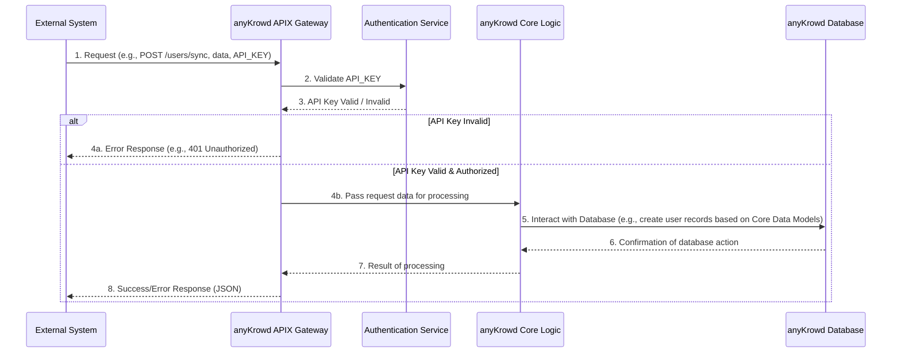

# Chapter 7: APIX (External API)

Welcome to Chapter 7! In our [previous chapter, "Core Data Models"](06_core_data_models_.md), we explored the "blueprints" that define the key pieces of information in anyKrowd, like Events, Users, and Tickets. These blueprints ensure everyone and every part of anyKrowd speaks the same language.

But what if an *external* software system, one that isn't Adminx, Clientx, or Staffx, needs to talk to anyKrowd? For example, imagine a large company, "MegaCorp," has purchased bulk tickets for its employees to attend MusicFest. MegaCorp wants its own HR system to automatically create user accounts in anyKrowd for these employees and assign them their tickets. How can MegaCorp's HR system communicate with anyKrowd to do this?

This is where **APIX (External API)** comes in!

## What is APIX? anyKrowd's Friendly Diplomat

**APIX** is the **public-facing Application Programming Interface** for anyKrowd. Think of it as anyKrowd's official **gateway or diplomat** that allows other computer programs and third-party services to securely "talk" to the anyKrowd platform.

It's like a universal translator:
*   External systems might "speak" different programming languages or have different ways of structuring data.
*   APIX defines a clear, standardized way for them to send requests to anyKrowd and receive responses.

APIX allows these external systems to:
*   **Request information:** Like getting a list of upcoming events, details of a specific user's [Digital Wallet System](04_digital_wallet_system_.md), or ticket sales figures.
*   **Send data:** Like creating new user accounts (our MegaCorp example), updating event information, or even triggering actions like topping up a wallet.

To ensure these interactions are secure, APIX uses **API keys** for authentication. Only systems with a valid API key can use APIX.

## How APIX Helps MegaCorp Sync Its Employees

Let's go back to MegaCorp. Their HR system needs to create accounts in anyKrowd for hundreds of employees so they can access their MusicFest tickets via the [Clientx Application Core](02_clientx_application_core_.md).

Instead of someone manually creating these accounts in Adminx (which would be slow and error-prone), MegaCorp's HR system can use APIX:

1.  **MegaCorp gets an API Key:** The anyKrowd team provides MegaCorp with a unique, secret API key. This key identifies MegaCorp's HR system as a trusted partner.
2.  **HR System Prepares Data:** The HR system gathers the list of employees (name, email, etc.) who need tickets. This data will be structured according to the [Core Data Models](06_core_data_models_.md) that APIX expects for users.
3.  **HR System Makes an APIX Request:** The HR system sends an electronic request to a specific APIX web address (called an "endpoint"). This request includes:
    *   The employee data.
    *   MegaCorp's API key (to prove its identity).
4.  **anyKrowd Processes the Request:** anyKrowd's APIX system receives the request.
    *   It checks the API key using the [Authentication & Authorization System](05_authentication___authorization_system_.md).
    *   If the key is valid, it processes the employee data, creating new user accounts in anyKrowd.
5.  **anyKrowd Sends a Response:** APIX sends a message back to MegaCorp's HR system confirming that the users were created (or if there were any issues).

Now, all MegaCorp employees can log into Clientx and see their MusicFest tickets! This was all done automatically, thanks to APIX.

## Key Things to Know About APIX

When an external system uses APIX, it involves a few key concepts:

*   **Endpoints:** These are specific URLs (web addresses) that the external system sends requests to. Each endpoint is for a particular action or type of data.
    *   Example: `/apix/v1/events/list` might be the endpoint to get a list of all events.
    *   Example: `/apix/v1/users/sync` (from `apix-documentation.md`) is the endpoint MegaCorp would use to send employee data.
*   **Methods (HTTP Verbs):** These tell APIX what kind of action the external system wants to perform. Common methods include:
    *   `GET`: To retrieve data (e.g., get event list).
    *   `POST`: To send new data to be created (e.g., create new users).
    *   `PUT`: To update existing data.
    *   `DELETE`: To remove data.
*   **Requests:** The message sent *by* the external system *to* an APIX endpoint. It includes the API key, the method, and often some data (especially for `POST` or `PUT` requests).
*   **Responses:** The message sent *back by* APIX *to* the external system after processing the request. It usually indicates success or failure and might include the requested data.
*   **Data Format (JSON):** APIX typically expects data in requests and sends data in responses using **JSON** (JavaScript Object Notation). JSON is a human-readable text format that's easy for computers to understand.
*   **API Key Authentication:** As mentioned, the external system must include its secret API key with every request. This is how APIX knows who is making the request and if they are allowed to do so. This is part of the [Authentication & Authorization System](05_authentication___authorization_system_.md).

## Using APIX: A Couple of Simple Examples

Let's look at how an external system might interact with APIX, using simplified examples inspired by the `apix-documentation.md`.

### Example 1: Getting a List of Events

Imagine a partner website wants to display a list of events happening at your venue, sourced from anyKrowd.

1.  **The Request:** The partner website's server would make a `GET` request to the `/apix/v1/events/list` endpoint. It would include its API key in a special part of the request called a "header."

    A `curl` command (a tool for making web requests from the command line) might look like this:
    ```bash
    # Request to get a list of events
    curl -H "Authorization: Bearer YOUR_API_KEY" \
         -H "Accept: application/json" \
         https://yourvenue.anykrowd.dev/apix/v1/events/list
    ```
    *   `-H "Authorization: Bearer YOUR_API_KEY"`: This is where the secret API key goes.
    *   `-H "Accept: application/json"`: Tells APIX we want the response in JSON format.
    *   The URL is the APIX endpoint for listing events.

2.  **The Response:** If the API key is valid, APIX would respond with a JSON list of events. The data for each event would follow the "Event" [Core Data Models](06_core_data_models_.md).

    A simplified JSON response might look like this:
    ```json
    {
        "data": [
            {
                "id": 1,
                "name": "MusicFest 2024",
                "start_datetime": "2024-08-15 18:00:00"
                // ... other event details
            },
            {
                "id": 2,
                "name": "Tech Conference",
                "start_datetime": "2024-09-10 09:00:00"
                // ... other event details
            }
        ]
        // ... other info like page numbers if many events
    }
    ```
    The partner website's system can then read this JSON and display the event names and start times.

### Example 2: Synchronizing Staff Users (Like MegaCorp)

This is similar to our MegaCorp example, using the `/apix/v1/users/sync` endpoint documented in `apix-documentation.md`.

1.  **The Request:** MegaCorp's HR system would make a `POST` request. `POST` is used because it's *sending new data* to be created. The data (the list of staff members) is sent in the body of the request, in JSON format.

    A `curl` command might look like this:
    ```bash
    # Request to synchronize staff users
    curl -X POST \
         -H "Authorization: Bearer YOUR_API_KEY" \
         -H "Content-Type: application/json" \
         -d '{
               "staff_members": [
                 {
                   "external_id": "emp123",
                   "first_name": "Alice",
                   "last_name": "Smith",
                   "create_user_account": true
                 }
               ]
             }' \
         https://yourvenue.anykrowd.dev/apix/v1/users/sync
    ```
    *   `-X POST`: Specifies the `POST` method.
    *   `-H "Content-Type: application/json"`: Tells APIX the data we're sending is JSON.
    *   `-d '{...}'`: This is the JSON data for the new staff member, Alice Smith. It uses fields like `external_id`, `first_name` which are part of the User [Core Data Models](06_core_data_models_.md).

2.  **The Response:** If the API key is valid and the data is correct, APIX would process it (create the user account for Alice) and send back a success message.

    A simplified success response (from `apix-documentation.md`):
    ```json
    {
        "success": true
    }
    ```
    MegaCorp's HR system knows Alice's account was created!

## Under the Hood: How APIX Handles a Request

When an external system sends a request to APIX, several things happen behind the scenes within the anyKrowd backend:



1.  **Request Received:** The external system sends its request (including data and the API key) to the appropriate APIX endpoint (e.g., `/apix/v1/users/sync`).
2.  **Authentication:** The APIX Gateway, part of the anyKrowd backend, first checks the API key with the [Authentication & Authorization System](05_authentication___authorization_system_.md). Is this a known, valid API key?
3.  **Authorization (Implied):** If the key is valid, the system also implicitly checks if this API key is *allowed* to perform the requested action on this endpoint. (Some keys might only have read-only access, for example).
4.  **Processing:**
    *   If authentication fails or the key isn't authorized for the action, APIX sends an error response back (e.g., "401 Unauthorized" or "403 Forbidden").
    *   If all checks pass, APIX passes the request data to the relevant part of the anyKrowd Core Logic. This logic will then interact with the [Core Data Models](06_core_data_models_.md) – for example, creating new `User` records in the database if it's a `/users/sync` request.
5.  **Response Sent:** The Core Logic tells APIX if the operation was successful. APIX then formats a JSON response and sends it back to the external system.

This whole process ensures that external interactions are secure and that data is handled correctly according to anyKrowd's internal rules and structures.

The actual code for APIX lives within the anyKrowd backend. For example, a backend framework (like Laravel, which is used in parts of anyKrowd) would define "routes" that map APIX URLs to specific functions that handle the requests.

Here's a conceptual peek at how a route for `/apix/v1/users/sync` might be defined in the backend (this is not exact code, just an idea):

```php
// Hypothetical backend route definition (e.g., in a PHP framework)
// Route::post('/apix/v1/users/sync', 'UserApiController@syncStaff');
// This says: "When a POST request comes to /apix/v1/users/sync,
// call the 'syncStaff' function in the 'UserApiController'."
```
And the `syncStaff` function would contain the logic to validate the input, create users, and return a JSON response, all while respecting the [Core Data Models](06_core_data_models_.md) and security checks.

## Conclusion

APIX (External API) is the essential bridge that allows anyKrowd to connect and exchange information with the wider world of software. It acts as a secure and standardized "diplomat," enabling external systems and third-party services to:

*   Securely authenticate using API keys.
*   Request data from anyKrowd (like event lists or wallet balances).
*   Send data to anyKrowd (like synchronizing users or topping up wallets).

By defining clear rules for communication (endpoints, methods, JSON data format), APIX makes it possible to integrate anyKrowd with other important tools and platforms, automating tasks and extending the reach of your event management capabilities. This is crucial for creating a truly connected and efficient event ecosystem.

In the next chapter, we'll explore how all the data gathered by anyKrowd, some of which might even come *through* APIX, can be turned into valuable insights.

Next up: [Embeddable Analytics (Cube.js Data Models)](08_embeddable_analytics__cube_js_data_models_.md)

---

Generated by [AI Codebase Knowledge Builder](https://github.com/The-Pocket/Tutorial-Codebase-Knowledge)