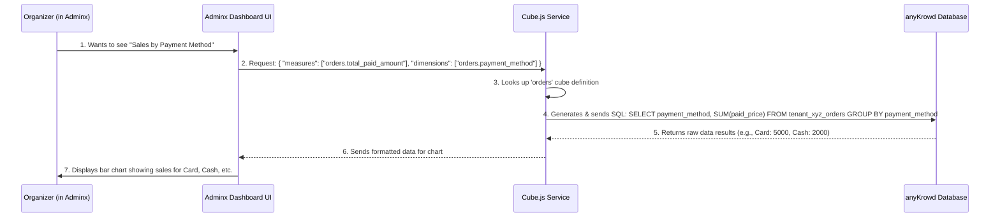

# Chapter 8: Embeddable Analytics (Cube.js Data Models)

Welcome to Chapter 8! In our [previous chapter, "APIX (External API)"](07_apix__external_api_.md), we saw how external systems can talk to anyKrowd. All these interactions, plus everything attendees and staff do, generate a lot of data! But raw data isn't very helpful on its own. How can an event organizer make sense of it all to see how their event is *really* doing?

Imagine you're the organizer of MusicFest. The event is live! People are buying merchandise, food, and drinks using the [Digital Wallet System](04_digital_wallet_system_.md), and staff are scanning tickets at the gates using [Staffx Application Core](03_staffx_application_core_.md). You want to know:
*   How many "VIP Tickets" vs. "General Admission Tickets" have been sold *right now*?
*   What are the busiest hours for check-ins at the main gate?
*   Which food stall is making the most sales?

You need a **control room dashboard** filled with charts and graphs that answer these questions instantly. This is precisely what **Embeddable Analytics with Cube.js Data Models** provides for anyKrowd!

## What is Embeddable Analytics with Cube.js? Your Event's Smart Dashboard

Think of **Embeddable Analytics** as the "mission control" for your event, built right into the Adminx platform. It's where organizers can see charts, graphs, and key numbers about event performance in real-time.

To power this dashboard, anyKrowd uses a clever tool called **Cube.js**.

**What is Cube.js?**
Cube.js is like a super-smart **interpreter for your event data**. Your event data (sales, check-ins, etc.) is stored in a database, often in a raw, detailed format based on our [Core Data Models](06_core_data_models_.md). Cube.js sits between this raw data and your dashboard. It helps you:
1.  **Define Data Schemas (called "Cubes"):** You tell Cube.js how to understand your raw data and what's important.
2.  **Ask Questions:** You can ask things like "Show me total sales, broken down by each ticket type."
3.  **Get Answers for Dashboards:** Cube.js crunches the numbers and provides data perfectly formatted for displaying in charts and graphs.

This means organizers don't need to be database experts to get powerful insights. The "Embeddable" part means these analytics dashboards are seamlessly integrated into the Adminx application, making them easy to access.

## Key Ideas: Cubes, Dimensions, and Measures

To understand how Cube.js works, let's look at a few key ideas:

1.  **Cubes:**
    *   Imagine a LEGO box for "Orders," another for "Users," and another for "Events." Each box (or **Cube**) is designed to help you analyze data related to that specific topic. For example, the `orders` cube helps you analyze sales data.
    *   These cubes are defined in special configuration files (usually ending in `.cube.yml`).

2.  **Dimensions:**
    *   These are the different ways you can **slice and dice** or **group** your data. Think of them as categories.
    *   For an `orders` cube, dimensions could be:
        *   `payment_method` (e.g., "Cash," "Card," "Online")
        *   `product_name` (e.g., "VIP Ticket," "Festival T-Shirt")
        *   `location_name` (e.g., "Main Stage Bar," "Merch Tent A")
        *   `created_at` (e.g., by day, by hour)

3.  **Measures:**
    *   These are the actual **numbers or calculations** you want to see. They are what you "measure."
    *   For an `orders` cube, measures could be:
        *   `count` (e.g., total number of orders)
        *   `paid_price_sum` (e.g., total sales amount)
        *   `average_order_value` (e.g., the average amount spent per order)

By combining dimensions and measures, organizers can get very specific insights. For example, "Show me the `paid_price_sum` (measure) for each `product_name` (dimension)." This would give you total sales for each product.

## How Organizers See Event Performance

Let's go back to our MusicFest organizer using Adminx.

1.  **Login to Adminx:** The organizer logs into their Adminx panel.
2.  **Navigate to Analytics/Dashboard:** They go to a section showing event dashboards.
3.  **View Charts:** They see charts like:
    *   A pie chart showing **"Total Sales by Product Category,"** using the `orders` cube, the `paid_price_sum` measure, and a `product_category` dimension.
    *   A bar chart showing **"Check-ins per Hour,"** perhaps using an `access_checks` cube (or similar), a `count` measure, and an `hour_of_check_in` dimension.
    *   A table showing **"Top Selling Items,"** using the `ordered_products` cube, the `total_quantity` measure, and the `product_name` dimension, sorted to show the highest quantities first.

These charts update in near real-time, giving the organizer a live view of what's happening. They didn't need to write any complex database queries; Cube.js handled that based on how the cubes, dimensions, and measures were defined.

## Under the Hood: Defining a "Cube"

Let's peek at how one of these "cubes" might be defined. These definitions are typically in YAML files (like `.yml`). We'll look at a *super simplified* version of what might be in `embeddable/src/models/cubes/orders.cube.yml`.

```yaml
# Simplified from embeddable/src/models/cubes/orders.cube.yml
cubes:
  - name: orders # This is our "Orders" lens or cube
    # Tells Cube.js to get raw data from the 'orders' table in our database
    # `{COMPILE_CONTEXT.securityContext.dbPrefix}` helps get data for the *specific* event
    sql: SELECT * FROM `{COMPILE_CONTEXT.securityContext.dbPrefix}`.orders
    
    dimensions: # Ways to slice and dice the order data
      - name: payment_method # Dimension: How was the order paid?
        sql: payment_method  # Corresponds to the 'payment_method' column in the database
        type: string         # The data type is text

      - name: status # Dimension: What is the order status?
        sql: payment_status # Corresponds to the 'payment_status' column
        type: string

    measures: # Things we want to calculate about orders
      - name: count # Measure: How many orders are there in total?
        type: count  # Cube.js will count the number of order records

      - name: total_paid_amount # Measure: What's the sum of money paid?
        sql: paid_price       # Corresponds to the 'paid_price' column
        type: sum             # Cube.js will sum up all the 'paid_price' values
```

**Let's break this down:**

*   `name: orders`: We're defining a cube named "orders."
*   `sql: SELECT * FROM \`{COMPILE_CONTEXT.securityContext.dbPrefix}\`.orders`: This tells Cube.js that the raw data for this cube comes from a database table named `orders`. The `securityContext.dbPrefix` part is important; it ensures that if you have multiple events (or "tenants"), Cube.js looks at the `orders` table for *only the current event* you're viewing in Adminx. This is linked to [Tenant Configuration](09_tenant_configuration_.md).
*   `dimensions:`: This section defines our categories.
    *   `payment_method`: We can group orders by how they were paid. The actual data comes from the `payment_method` column in the database table.
    *   `status`: We can group orders by their payment status.
*   `measures:`: This section defines our calculations.
    *   `count`: A simple count of how many orders exist.
    *   `total_paid_amount`: This calculates the sum of the `paid_price` column, giving us the total revenue.

The actual `orders.cube.yml` file is much more detailed, with many more dimensions (like `location_name`, `currency_name`) and measures (like `cash_topup_sum`, `total_products_purchased`). These rich definitions allow for very flexible and powerful reporting. You can also see cubes for `users`, `events`, `wallets`, and `ordered_products` in the `embeddable/src/models/cubes/` directory, each tailored to analyze different aspects of your event data.

### How a Chart Gets Its Data: A Simplified Flow

So, an organizer clicks a button in Adminx to see "Total Sales by Payment Method." What happens?



1.  The **Organizer** interacts with the dashboard in **Adminx**.
2.  The **Adminx Dashboard UI** (using a library that talks to Cube.js) sends a structured query to the **Cube.js Service**. This query essentially says, "I need the `total_paid_amount` measure from the `orders` cube, and I want it broken down by the `payment_method` dimension."
3.  **Cube.js** receives this, looks at its definition for the `orders` cube (like the YAML file we saw).
4.  Cube.js intelligently translates the request into an efficient **SQL query** (the language databases understand) and sends it to the **anyKrowd Database**. It knows to sum the `paid_price` and group by `payment_method`.
5.  The **Database** runs the SQL query on the raw data tables (which hold data according to the [Core Data Models](06_core_data_models_.md)) and sends the results back to Cube.js.
6.  **Cube.js** gets the raw results, processes them if needed, and sends them back to the **Adminx Dashboard UI** in a clean, chart-ready format.
7.  The **Adminx Dashboard UI** then uses this data to draw the bar chart for the organizer.

This all happens very quickly, giving the organizer the insights they need!

### Keeping Things Organized and Fresh

*   **`embeddable/src/cube.js`:** This file contains some configuration for Cube.js.
    *   `contextToAppId`: This helps Cube.js manage different data sets or configurations, especially in a multi-tenant environment (where one anyKrowd installation might serve many different events). It generates a unique ID for each "context" (like each event's data).
    *   `scheduledRefreshContexts`: This can be used to tell Cube.js to pre-calculate or refresh certain data regularly, so dashboards load even faster.
*   **`embeddable/README.md`:** This file provides instructions for developers working on these Cube.js models. It mentions how to:
    *   Build and deploy changes to the analytics components.
    *   Run a local development environment to test new charts or data models.
    *   Debug data models using Cube's own "playground" tool, which often involves connecting directly to a database by setting credentials in a `.env` file. This highlights that Cube.js needs direct access to the raw data.
    *   It also talks about "pre-aggregations," which are like pre-calculated summaries that Cube.js can store to make dashboards load super fast, especially for large amounts of data. The `.cube.yml` files (like `orders.cube.yml`) show `pre_aggregations` defined for different time granularities (day, week, month).

## The Power of Insight

By using Cube.js to define these data models, anyKrowd provides its organizers with a powerful, yet user-friendly analytics system. Organizers can:
*   Get **real-time insights** into event performance.
*   See data from many different angles (dimensions).
*   Track key metrics (measures) like sales, attendance, wallet usage, etc.
*   Make **data-driven decisions** to improve their current event or plan future ones better.

It's like having a data scientist built into your event platform, constantly analyzing information and presenting it in an easy-to-understand way.

## Conclusion

**Embeddable Analytics, powered by Cube.js Data Models,** transforms raw event data into the organizer's "control room dashboard." By defining "cubes," "dimensions," and "measures," anyKrowd allows event managers to easily explore their data, visualize trends, and get actionable insights directly within the Adminx platform. This is crucial for understanding event performance, spotting opportunities, and making informed decisions on the fly.

These analytics often need to adapt based on how each specific event or organizer (tenant) is set up. In the next chapter, we'll explore how anyKrowd manages these individual configurations.

Next up: [Tenant Configuration](09_tenant_configuration_.md)

---

Generated by [AI Codebase Knowledge Builder](https://github.com/The-Pocket/Tutorial-Codebase-Knowledge)