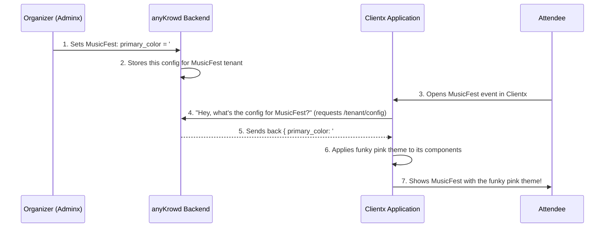

# Chapter 9: Tenant Configuration

Welcome to Chapter 9! In our [previous chapter, "Embeddable Analytics (Cube.js Data Models)"](08_embeddable_analytics__cube_js_data_models_.md), we saw how event organizers can get amazing insights into their event's performance. We even touched on how analytics can be specific to an event, using things like a `dbPrefix`. This idea of "event-specific" settings is super important, and that's what we're diving into now: **Tenant Configuration**.

## Your Event, Your Rules: What is Tenant Configuration?

Imagine you're an event organizer. You're planning "MusicFest," a vibrant outdoor music festival. Your friend, another organizer, is planning "TechCon," a formal business conference. Would you want the attendee app for MusicFest to look and behave exactly the same as the one for TechCon? Probably not!

*   **MusicFest** might need a colorful theme, options for attendees to top up RFID wristbands for food, and features to discover band schedules.
*   **TechCon** might prefer a professional, branded look, options for attendees to log in with their Google accounts, and features to view speaker bios and session tracks.

How does anyKrowd make this possible? How can it provide a unique, tailored experience for each event or venue? This is where **Tenant Configuration** comes in.

**What's a "Tenant"?**
In anyKrowd, a "tenant" is typically an event organizer or a venue. It's like they're "renting" a space within the anyKrowd platform to run their events. Each tenant can have one or more events.

**What's "Configuration"?**
Configuration simply means settings and customizations. Think of it as a personalized settings menu for each tenant and their events.

**Tenant Configuration** is the system that allows each event organizer (tenant) to:
*   Customize the look and feel (branding) of their event in the [Clientx Application Core](02_clientx_application_core_.md) and [Staffx Application Core](03_staffx_application_core_.md).
*   Turn specific features on or off (feature toggles).
*   Set up event-specific rules, like which payment methods are allowed.

This ensures that each event feels unique and perfectly suited to its audience and purpose.

## The Use Case: MusicFest vs. TechCon

Let's say our MusicFest organizer wants:
*   Clientx to show the MusicFest logo and use bright, funky colors.
*   To enable RFID payments for cashless food/drink purchases in Staffx.
*   To *disable* the option for attendees to log in with Facebook in Clientx.

Meanwhile, the TechCon organizer wants:
*   Clientx to show the TechCon corporate logo and use sleek, professional colors.
*   To *disable* RFID payments (they're not using wristbands) but *enable* QR code-based payments via Clientx.
*   To *enable* Google login for attendees in Clientx.

Tenant Configuration makes all this possible! The organizers would use **Adminx** (the ringleader's tent we met in [Chapter 1: anyKrowd Platform Architecture](01_anykrowd_platform_architecture_.md)) to set up these preferences for their specific event. The anyKrowd system then ensures that Clientx and Staffx respect these choices.

## What Can Be Configured? A Peek at the "Settings Menu"

The "settings menu" for a tenant is quite extensive! The actual settings are defined in data structures, often called `TenantConfiguration` or similar. Let's look at a few examples from the code to get an idea.

### For Staffx (Staff App)

Staff on the ground need their app to behave according to the event's rules. The `TenantConfiguration` model in Staffx helps with this.

```typescript
// Simplified from staffx/src/app/core/models/Tenant.ts
export class TenantConfiguration {
    tenant_name = ''; // e.g., "MusicFest 2024"
    tenant_logo_url = ''; // URL for the event's logo

    enable_card_payments = false; // Can staff accept card payments?
    enable_rfid_payments = true;  // Can staff accept RFID wristband payments?
    enable_qr_payments = true;    // Can staff accept QR code payments (from Clientx app)?

    staffx_default_vat_percentage = 21; // Default VAT for sales

    // ... many other settings
}
```
*   `tenant_name` and `tenant_logo_url`: Help brand the Staffx app slightly for the specific event staff are working on.
*   `enable_rfid_payments = true;`: If the MusicFest organizer sets this to `true`, then the Staffx app used by vendors at MusicFest will have the RFID payment option enabled. If the TechCon organizer sets it to `false`, that option would be disabled or hidden in Staffx for TechCon.
*   `staffx_default_vat_percentage`: Allows setting a default tax rate for sales made through Staffx.

There's also a `TenantOptions` class that often handles visual styling:
```typescript
// Simplified from staffx/src/app/core/models/Tenant.ts
export class TenantOptions {
    logo_url: string;       // e.g., "https://musicfest.com/logo.png"
    primary_color: string;  // e.g., "#FF69B4" (a bright pink for MusicFest)
    // ... other color settings
}
```
*   `primary_color`: This would change the main theme color in the Staffx interface to match the event's branding.

### For Clientx (Attendee App)

Attendees will see the most significant impact of these configurations in their Clientx app.

```typescript
// Simplified from clientx/src/app/core/models/AppConfiguration.ts
// (Similar structure in clientx-vue/src/shared/interfaces/tenant.ts)
export class TenantConfiguration {
    enable_public_mode = false;   // Can people browse event info without logging in?
    enable_facebook_login = true; // Allow login with Facebook?
    enable_google_login = true;   // Allow login with Google?
    
    hide_wallet = false;          // Should the digital wallet feature be hidden?
    hide_tickets = false;         // Should the tickets section be hidden?

    privacy_policy: string = '';  // URL to the event's privacy policy
    // ... many other settings
}
```
*   `enable_public_mode`: If `true`, attendees can see some event details in Clientx even before they log in.
*   `enable_facebook_login`: MusicFest might set this to `false`, while TechCon sets it to `true`.
*   `hide_wallet`: If an event doesn't use the [Digital Wallet System](04_digital_wallet_system_.md), the organizer can set this to `true` to remove the wallet section from Clientx.
*   `privacy_policy`: Each event can link to its own specific privacy policy document.

These are just small snippets! The actual configuration files (like `clientx/src/app/core/models/AppConfiguration.ts`, `staffx/src/app/core/models/Tenant.ts`, and `clientx-vue/src/shared/interfaces/tenant.ts`) list dozens of such options, giving organizers fine-grained control.

## How It Works: From Organizer's Choice to App Experience

So, how do these settings actually change the apps?

1.  **Organizer Configures in Adminx:**
    The event organizer logs into their Adminx panel. They find a section for event settings or customization. Here, they can toggle switches, enter text (like a privacy policy URL), and pick colors. When they save, these choices are sent to the anyKrowd backend.

2.  **Backend Stores the Configuration:**
    The anyKrowd backend receives these settings and stores them in its database. Importantly, these settings are linked to the specific *tenant ID* (the organizer or venue). This means MusicFest's settings are stored separately from TechCon's settings.

3.  **Clientx/Staffx Fetches Configuration on Startup:**
    When an attendee opens Clientx for MusicFest (or a staff member opens Staffx for MusicFest), the app needs to know how it should look and behave. One of the first things it does is ask the anyKrowd backend: "What are the configurations for *this specific event/tenant*?"

    In Clientx (Angular version), the `ConfigService` handles this:
    ```typescript
    // Simplified from clientx/src/app/core/services/config.service.ts
    export class ConfigService {
      constructor(public api: ApiService) {} // ApiService talks to backend

      public getTenantConfiguration(): Observable<TenantConfiguration> {
        // Asks the backend for tenant-specific configuration
        return this.api.get<TenantConfiguration>(`${window.apiUrl}/tenant/config`);
      }
      // ... also a method for getTenantOptions (styles)
    }
    ```
    This service makes a network request to a backend URL (like `/tenant/config`). The backend looks up the settings for the current tenant and sends them back. A similar service, `TenantConfigService`, exists in Staffx (`staffx/src/app/core/services/tenant-config.service.ts`).

4.  **App Applies the Configuration:**
    Once Clientx or Staffx receives the configuration data (which matches the structure of their `TenantConfiguration` models), they use it to adjust their appearance and functionality.
    *   If `primary_color` is "#FF69B4", the app changes its theme color.
    *   If `enable_rfid_payments` is `true`, the RFID payment button is shown. If `false`, it's hidden.
    *   If `hide_wallet` is `true`, the entire wallet menu item might disappear.

This dynamic loading of configuration ensures that the same Clientx or Staffx application can provide a vastly different experience depending on which event it's being used for.

### A Visual Flow: Configuration in Action

Let's visualize how MusicFest's primary color gets applied to Clientx:



This flow ensures that every time an attendee or staff member uses an app for a particular event, they get the experience exactly as the event organizer intended.

## Why is Tenant Configuration Important?

*   **Personalization & Branding:** It allows each event to have its own identity within the apps.
*   **Flexibility:** Organizers can enable only the features they need, keeping the apps uncluttered.
*   **Control:** Organizers manage their event's digital presence and operational rules.
*   **Scalability:** The same anyKrowd platform can serve many different types of events with unique requirements.

## Conclusion

**Tenant Configuration** is like the master control panel for each event organizer using anyKrowd. It empowers them to customize everything from theme colors and logos to feature availability and payment methods across both the [Clientx Application Core](02_clientx_application_core_.md) and [Staffx Application Core](03_staffx_application_core_.md).

By storing these settings in the backend and allowing the apps to fetch them dynamically, anyKrowd ensures a personalized, branded, and relevant experience for every event, whether it's a huge music festival or a focused corporate conference. This adaptability is key to making anyKrowd a versatile platform for all kinds of events.

Now that we've seen how events can be customized, let's look at some specialized tools that the Staffx app can use, especially when interacting with hardware.

Next up: [Staffx Capacitor Plugins](10_staffx_capacitor_plugins_.md)

---

Generated by [AI Codebase Knowledge Builder](https://github.com/The-Pocket/Tutorial-Codebase-Knowledge)