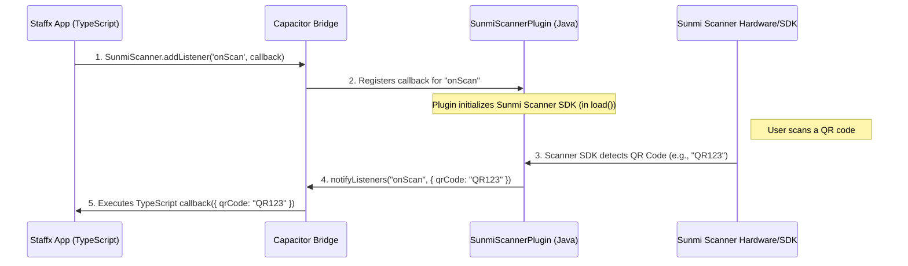

# Chapter 10: Staffx Capacitor Plugins

Welcome to the final chapter of our anyKrowd tutorial series! In the [previous chapter, "Tenant Configuration"](09_tenant_configuration_.md), we learned how anyKrowd can be customized for different events and organizers, tailoring the experience for both attendees and staff. Now, we're going to zoom in on a special feature of the [Staffx Application Core](03_staffx_application_core_.md): its ability to talk directly to physical hardware!

Imagine Tom, our event staff member, is using a specialized handheld device (like a Sunmi terminal) at MusicFest. This device has a built-in barcode scanner. How can the Staffx app, which is essentially a web application running on that device, actually use that scanner to check tickets? It's not like a regular website in a browser can just control a barcode scanner!

This is where **Staffx Capacitor Plugins** come into play. They are the magic that bridges the gap between the Staffx web-based software and the device's physical hardware.

## What are Staffx Capacitor Plugins? Talking to the Hardware

As the concept description tells us:
> These are specialized modules within the Staffx application that interface with native device hardware, primarily on Sunmi devices. This includes QR/barcode scanners (SunmiScanner), NFC readers (P2MiniPlugin), and payment terminals (VivaWalletPlugin, MultiSafePayPlugin).
>
> Think of these as adapters that allow the Staffx software to "talk" directly to physical hardware, like connecting a universal remote to different electronic devices.

Let's break this down:

*   **Capacitor:** First, you need to know about **Capacitor**. Staffx is built using web technologies (like Angular and Ionic). Capacitor is a tool that takes this web app and wraps it up so it can run like a native app on devices (like Android phones or tablets). Capacitor is the main **bridge** that allows web code to talk to native device features.

*   **Capacitor Plugins:** A "plugin" is a special piece of code that extends what Capacitor can do. For Staffx, these plugins are specifically written to control particular pieces of hardware.
    *   If Staffx needs to use the **Sunmi device's built-in QR/barcode scanner**, it uses the `SunmiScanner` plugin.
    *   If it needs to read an **NFC tag** (like an RFID wristband) on a Sunmi P2Mini device, it uses the `P2MiniPlugin`.
    *   If it needs to initiate a payment using a **Viva Wallet payment terminal**, it uses the `VivaWalletPlugin`.
    *   If it needs to use a **MultiSafePay payment terminal**, it uses the `MultiSafePayPlugin`.

**The "Universal Remote" Analogy:**
Imagine your Staffx app is a universal remote control. Your TV, DVD player, and sound system are all different hardware devices. The universal remote needs specific "adapters" or "codes" to know how to talk to each one. Staffx Capacitor Plugins are like these adapters for hardware features. The Staffx app (the remote) tells the `SunmiScanner` plugin (the adapter for the scanner "device") to "scan a barcode," and the plugin makes it happen.

## Tom's Task: Scanning a Ticket with a Sunmi Device

Let's follow Tom again. He's at the MusicFest gate with a Sunmi handheld device running the Staffx app. An attendee, Sarah, presents her ticket QR code.

1.  Tom taps the "Scan Ticket" button in the Staffx app.
2.  The Staffx app (which is web code) needs to tell the Sunmi device's built-in scanner to activate.
3.  It does this by calling the `SunmiScanner` Capacitor plugin.
4.  The plugin talks to the actual scanner hardware.
5.  The scanner reads Sarah's QR code.
6.  The plugin gets the QR code data from the scanner and sends it back to the Staffx web app.
7.  Staffx then processes the QR code to validate Sarah's ticket.

Without the `SunmiScanner` plugin, the Staffx web app would have no way to use the built-in scanner!

## How Staffx Uses a Plugin (The Web App Side)

The Staffx application code, written in TypeScript (a language that's very similar to JavaScript), interacts with these plugins. Let's look at a simplified example of how it might use the `SunmiScanner` plugin.

First, Staffx needs to know what functions the `SunmiScanner` plugin offers. This is defined in a TypeScript file:

```typescript
// Simplified from staffx/src/app/core/plugins/sunmi_scanner/sunmi_scanner.plugin.ts
import { PluginListenerHandle, registerPlugin } from '@capacitor/core';

export interface SunmiScannerPlugin {
    startScanning(): Promise<void>; // Method to tell the scanner to start
    stopScanning(): Promise<void>;  // Method to tell the scanner to stop

    // Method to listen for scan events
    addListener(
        eventName: 'onScan',
        listenerFunc: ({ qrCode }) => void,
    ): Promise<PluginListenerHandle> & PluginListenerHandle;
}

// This makes the plugin available to the web app
const SunmiScanner = registerPlugin<SunmiScannerPlugin>('SunmiScanner');
export default SunmiScanner;
```
*   This code defines what the `SunmiScanner` "looks like" to the Staffx web app. It says the plugin has methods like `startScanning` and can listen for an `onScan` event.
*   `registerPlugin<SunmiScannerPlugin>('SunmiScanner')` is the key Capacitor function that connects the web app's `SunmiScanner` object to the native Java code for the plugin.

Now, in the Staffx app logic, Tom might tap a button. Here's what might happen (conceptually):

```typescript
// In a Staffx service or component
import SunmiScanner from 'src/app/core/plugins/sunmi_scanner/sunmi_scanner.plugin';

class TicketScannerService {
  async listenForScans() {
    // Tell the plugin to call our function when a QR code is scanned
    await SunmiScanner.addListener('onScan', ({ qrCode }) => {
      console.log('QR Code Scanned by Sunmi: ', qrCode);
      // Now, Staffx would use this qrCode to validate the ticket
      this.processScannedCode(qrCode);
    });
    // Note: In the real app, `startScanning` might be implicitly called by the hardware
    // or might be explicitly called if needed.
    // await SunmiScanner.startScanning();
  }

  processScannedCode(code: string) {
    // ... logic to check if the ticket is valid ...
  }
}
```
*   `SunmiScanner.addListener('onScan', ...)`: This tells the `SunmiScanner` plugin: "Hey, when you (the native scanner) successfully scan a QR code, please run this function and give me the `qrCode` data."
*   When the Sunmi device's scanner gets a QR code, the native plugin sends an "onScan" event, and the `listenerFunc` in the TypeScript code is executed with the scanned `qrCode`.

This way, the web-based Staffx app can receive data directly from the device's hardware! Similar patterns are used for other plugins like `P2MiniPlugin` (for NFC) or payment plugins like `VivaWalletPlugin`. For payment plugins, the interaction might involve launching a separate payment app on the device and then receiving a result back via the plugin.

## Under the Hood: From Web Code to Native Java

So, how does calling `SunmiScanner.addListener(...)` in TypeScript actually make the scanner work and send data back? This is where Capacitor and the native plugin code (written in Java for Android devices) come in.

1.  **Registration in `MainActivity.java`**:
    When the Staffx Android app starts, it needs to tell Capacitor about all the special native plugins it has. This happens in a file called `MainActivity.java`.

    ```java
    // Simplified from staffx/android/app/src/main/java/be/flowx/app/MainActivity.java
    package be.flowx.app;
    // ... other imports
    import com.getcapacitor.BridgeActivity;
    // Import our custom plugins
    import be.flowx.app.plugins.sunmi_scanner.SunmiScannerPlugin;
    import be.flowx.app.plugins.p2mini.P2MiniPlugin;
    import be.flowx.app.plugins.vivawallet.VivaWalletPlugin;
    // ...

    public class MainActivity extends BridgeActivity {
      @Override
      public void onCreate(Bundle savedInstanceState) {
        super.onCreate(savedInstanceState);
        // Registering our custom plugins with Capacitor
        registerPlugin(SunmiScannerPlugin.class);
        registerPlugin(P2MiniPlugin.class);
        registerPlugin(VivaWalletPlugin.class);
        // ... register other standard and custom plugins
      }
    }
    ```
    *   `registerPlugin(SunmiScannerPlugin.class);` tells Capacitor: "There's a native plugin called `SunmiScannerPlugin` available. If the web app asks for 'SunmiScanner', use this Java class."

2.  **The Native Plugin (e.g., `SunmiScannerPlugin.java`)**:
    This is the Java code that does the actual work of interacting with the Sunmi device's scanning SDK (Software Development Kit).

    ```java
    // Simplified from staffx/android/app/src/main/java/be/flowx/app/plugins/sunmi_scanner/SunmiScannerPlugin.java
    package be.flowx.app.plugins.sunmi_scanner;

    import com.getcapacitor.JSObject; // For sending data back to web
    import com.getcapacitor.Plugin;
    import com.getcapacitor.annotation.CapacitorPlugin;
    // ... other imports for Sunmi SDK

    @CapacitorPlugin(name = "SunmiScanner") // Must match the name used in JS
    public class SunmiScannerPlugin extends Plugin {
        private SunmiScanner implementation = new SunmiScanner(); // Helper class

        @Override
        public void load() { // Called when plugin is loaded
            if(android.os.Build.BRAND.contains("SUNMI")) { // Only for Sunmi devices
                implementation.bindScannerService(getContext()); // Initialize Sunmi scanner
                implementation.registerScannerReceiver(getContext(), this); // Listen for scans
            }
        }

        // This method is called by the Sunmi SDK when a barcode is scanned
        public void onScanSuccess(String barcode) {
            JSObject ret = new JSObject();
            ret.put("qrCode", barcode); // Put the scanned barcode into an object
            notifyListeners("onScan", ret); // Send "onScan" event to web app
        }
    }
    ```
    *   `@CapacitorPlugin(name = "SunmiScanner")`: This annotation links this Java class to the name "SunmiScanner" that the web app uses.
    *   `load()`: This method is called when the plugin first loads. Here, it checks if the device is actually a Sunmi device and then sets up the connection to the Sunmi scanner service.
    *   `onScanSuccess(String barcode)`: This is a conceptual method. In the real plugin, the `implementation.registerScannerReceiver` sets up a listener that, when the Sunmi hardware scans something, will eventually call a method like this *within the Java plugin*.
    *   `notifyListeners("onScan", ret);`: This is the crucial part! It sends an event named "onScan" (with the scanned `qrCode` data) back across the Capacitor bridge to any listeners in the Staffx web app. This is how `SunmiScanner.addListener('onScan', ...)` in TypeScript gets triggered.

### The Journey of a Scan Request:

Here's a simplified diagram showing how Staffx tells the scanner to be ready and gets data back:



1.  Staffx (TypeScript) tells Capacitor it wants to listen for "onScan" events from "SunmiScanner."
2.  Capacitor informs the native `SunmiScannerPlugin` (Java) about this listener. The Java plugin ensures the Sunmi hardware scanner is active (this setup usually happens in its `load()` method).
3.  When the physical Sunmi scanner hardware reads a QR code, it informs the Java `SunmiScannerPlugin`.
4.  The Java plugin uses `notifyListeners` to send the scanned data back through Capacitor.
5.  Capacitor delivers this data to the waiting TypeScript function in Staffx.

This same bridge mechanism allows the Staffx app to also *send commands* to the native plugins, for example, if there was an explicit `startScanning()` method defined in Java and called from TypeScript.

## Why Are These Plugins So Important?

*   **Access to Specialized Hardware:** Many event tasks rely on specialized hardware (scanners, payment terminals, NFC readers). Staffx Capacitor Plugins make it possible for the web-based Staffx app to use these tools effectively.
*   **Enhanced User Experience for Staff:** Using built-in hardware is often faster and more reliable than, say, trying to scan a QR code using a generic web camera API (which might be slower or less accurate).
*   **Leveraging Device Capabilities:** These plugins allow anyKrowd to take full advantage of the specific devices (like Sunmi terminals) that are often used in event environments.
*   **Seamless Operations:** For staff, it just feels like the app is naturally using the device's features, leading to smoother operations.

## Conclusion

Staffx Capacitor Plugins are the vital "adapters" that connect the web-based [Staffx Application Core](03_staffx_application_core_.md) to the physical hardware of the devices it runs on, especially specialized Sunmi terminals. They allow Staffx to control and receive data from barcode scanners, NFC readers, payment systems, and more.

By using Capacitor as a bridge and writing specific native Java code for each plugin, anyKrowd ensures that staff members like Tom can perform their on-site tasks efficiently, whether it's scanning a ticket with a `SunmiScanner`, tapping an RFID wristband with `P2MiniPlugin`, or processing a payment with `VivaWalletPlugin`. These plugins are key to making Staffx a powerful and versatile tool for on-the-ground event operations.

---

And that's a wrap on our anyKrowd tutorial series! We hope these chapters have given you a clear, beginner-friendly overview of the different components that make up the anyKrowd platform, from the overall [anyKrowd Platform Architecture](01_anykrowd_platform_architecture_.md) to the intricacies of how Staffx talks to hardware. Happy event managing!

---

Generated by [AI Codebase Knowledge Builder](https://github.com/The-Pocket/Tutorial-Codebase-Knowledge)