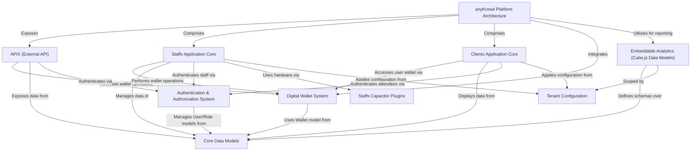

# Tutorial: anyKrowd

anyKrowd is an *event management platform* designed to streamline operations for organizers and enhance experiences for attendees. It features three main applications: **Adminx** for event planning, **Staffx** for on-site staff operations like ticket scanning and sales, and **Clientx** for attendees to manage tickets and use a *digital wallet*. The platform supports cashless payments, robust ticketing, and provides real-time analytics.

**Source Repository:** [None](None)

## Chapters

1. [anyKrowd Platform Architecture
](01_anykrowd_platform_architecture_.md)
2. [Clientx Application Core
](02_clientx_application_core_.md)
3. [Staffx Application Core
](03_staffx_application_core_.md)
4. [Digital Wallet System
](04_digital_wallet_system_.md)
5. [Authentication & Authorization System
](05_authentication___authorization_system_.md)
6. [Core Data Models
](06_core_data_models_.md)
7. [APIX (External API)
](07_apix__external_api__.md)
8. [Embeddable Analytics (Cube.js Data Models)
](08_embeddable_analytics__cube_js_data_models__.md)
9. [Tenant Configuration
](09_tenant_configuration_.md)
10. [Staffx Capacitor Plugins
](10_staffx_capacitor_plugins_.md)

---

Generated by [AI Codebase Knowledge Builder](https://github.com/The-Pocket/Tutorial-Codebase-Knowledge)