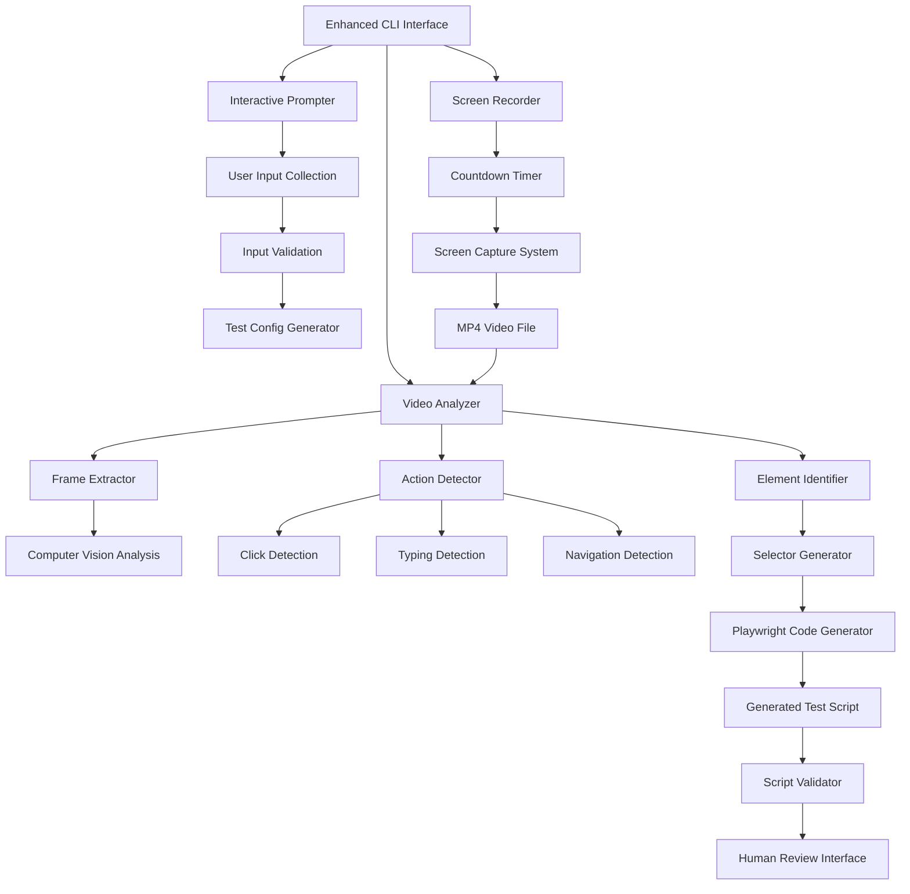

# TestX CLI UX Enhancement & Video Recording Analysis Specification
**Project:** TestX MVP CLI Enhancement  
**Company:** anyKrowd  
**Mission:** Intelligent CLI with step-by-step UX and video recording analysis for automated test creation  
**Status:** BMAD Team Collaborative Analysis Complete - Ready for Implementation  
**Date:** 2025-01-27  
**BMAD Team Analysis:**
- **Larry (Analyst):** Requirements analysis and user journey mapping
- **Millie (Design Architect):** CLI UX design and interaction patterns  
- **Mo (Architect):** Technical architecture and video analysis system
- **Curly (Product Owner):** Feature prioritization and story breakdown
- **Rodney (Full Stack Dev):** Implementation feasibility assessment
- **Sally (Scrum Master):** Sprint planning and story coordination

---

## Executive Summary

This specification transforms the TestX CLI from a basic command interface into an intelligent, step-by-step user experience that can record human demonstrations and automatically generate test scripts through video analysis. The enhanced CLI will guide users through test creation with interactive prompts, countdown warnings for screen recording, and AI-powered analysis of recorded actions to generate Playwright test scripts.

**Key Innovation:** Human-AI collaboration where users demonstrate workflows visually, and AI converts those demonstrations into automated test scripts.

## Problem Statement & BMAD Analysis

### Current CLI Limitations (Larry's Analysis)
1. **Poor UX for Incomplete Commands:** Users must know exact syntax or get cryptic errors
2. **No Guidance for New Users:** No step-by-step assistance for test creation
3. **Manual Test Creation Bottleneck:** Users must manually write all test scripts
4. **No Learning from Human Demonstrations:** Valuable human knowledge not captured
5. **Missing Context for Modules:** Users don't understand what modules are or how to use them

### User Pain Points Identified
- **Cognitive Load:** Users must remember complex command syntax
- **Discovery Problem:** No way to explore available options interactively
- **Knowledge Transfer Gap:** Expert testing knowledge not easily shared
- **Time-Intensive Test Creation:** Manual script writing is slow and error-prone
- **Lack of Visual Context:** No connection between user actions and test scripts

## Solution Overview (BMAD Team Collaborative Design)

### Enhanced CLI UX (Millie's Design)
**Interactive Step-by-Step Interface:**
```bash
# Current (Poor UX)
testx create clientx login-flow --url https://example.com

# Enhanced (Intelligent UX)
$ testx create
? Which module would you like to create tests for?
  ❯ ClientX (Client-facing application)
    StaffX (Staff operations interface) 
    AdminX (Administrative dashboard)
    
? What type of test scenario? 
  ❯ Authentication Flow (login, registration, OAuth)
    Wallet Operations (top-up, payments, transactions)
    Dashboard Navigation (menus, profile, settings)
    Custom Workflow (record your own demonstration)
    
? Please provide the target URL:
  ❯ https://krowd-dev.anykrowd.dev/#/auth/signuphome
  
? Would you like to:
  ❯ Record a demonstration (recommended for complex flows)
    Use existing template
    Start with blank test
    
✅ Great! I'll help you create a ClientX authentication test.
📹 Recording will start in 10 seconds. Please be ready to demonstrate the login flow.
⏰ Starting recording in: 10... 9... 8... 7... 6... 5... 4... 3... 2... 1... 
🔴 RECORDING STARTED - Demonstrate your login flow now
```

### Video Recording & Analysis System (Mo's Architecture)

**Technical Architecture:**


**Video Analysis Pipeline:**
1. **Frame Extraction:** Extract frames at key intervals (every 100ms during actions)
2. **Action Detection:** Identify clicks, typing, scrolling, navigation events
3. **Element Recognition:** Use OCR and visual recognition to identify UI elements
4. **Selector Generation:** Generate robust Playwright selectors for identified elements
5. **Code Generation:** Create Playwright test script from analyzed actions
6. **Validation:** Verify generated script against original recording

### Implementation Resources Analysis (Resources.md Review)

**Available Technologies in resources.md:**
- ✅ **Playwright CodeGen:** Already integrated for basic recording
- ✅ **Screen Recording:** Native OS capabilities (macOS: screencapture, Windows: built-in)
- ✅ **Computer Vision:** OpenCV.js for browser-based analysis
- ✅ **OCR:** Tesseract.js for text recognition in UI elements
- ✅ **Video Processing:** FFmpeg for video manipulation and frame extraction

**New Technologies Needed:**
- **Action Detection:** Custom ML model or rule-based system for detecting user actions
- **Element Tracking:** Visual element tracking across frames
- **Selector Optimization:** AI-powered selector generation for robustness

## Enhanced CLI Commands & UX Flow

### Core Enhanced Commands

#### 1. Interactive Test Creation
```bash
# Smart create command with step-by-step guidance
testx create
# OR with partial information
testx create clientx
testx create clientx auth
testx create clientx auth --url https://example.com

# Interactive prompts fill in missing information:
? Module: ClientX, StaffX, AdminX (with descriptions)
? Scenario Type: Auth, Wallet, Dashboard, Custom
? Target URL: [validation and auto-detection]
? Recording Method: Demonstrate, Template, Manual
```

#### 2. Enhanced Help & Discovery
```bash
# Contextual help with examples
testx help
testx help create
testx help modules

# Module exploration
testx modules
# Shows:
# ClientX: Client-facing application testing
#   - Authentication flows (login, registration, OAuth)
#   - Wallet operations (top-up, payments, balance)
#   - Dashboard navigation (profile, settings, menus)
#
# StaffX: Staff operations interface testing  
#   - POS operations (payments, refunds)
#   - Ticket scanning and validation
#   - Staff dashboard and reporting
```

#### 3. Recording & Analysis Commands
```bash
# Record with countdown and guidance
testx record clientx auth --url https://example.com
# Provides:
# - 10-second countdown
# - Recording instructions
# - Real-time recording status
# - Post-recording analysis

# Analyze existing recordings
testx analyze recording.mp4 --module clientx --scenario auth
testx analyze last-recording --enhance-selectors

# Review and edit generated tests
testx review generated-test.spec.ts --with-recording
```

### Step-by-Step UX Flow Design

**Phase 1: Information Gathering**
```
$ testx create

🎯 TestX Test Creator
Let's create a new test together!

? Which module would you like to test?
  ❯ ClientX - Client-facing application
    │ Authentication, wallet operations, user dashboard
    │ 
    StaffX - Staff operations interface
    │ POS systems, ticket scanning, staff tools
    │
    AdminX - Administrative dashboard  
    │ User management, analytics, system configuration
    │
    ℹ️  Learn more about modules: testx help modules

? What type of test scenario?
  ❯ Authentication Flow
    │ Login, registration, OAuth (Google/Facebook), logout
    │
    Wallet Operations
    │ Top-up, payments, balance checks, transaction history
    │
    Dashboard Navigation
    │ Menu navigation, profile management, settings
    │
    Custom Workflow
    │ Record your own demonstration for complex flows
    │
    ℹ️  See examples: testx examples clientx

? Target URL for testing:
  ❯ https://krowd-dev.anykrowd.dev/#/auth/signuphome
    
  ✅ Valid anyKrowd URL detected
  📍 Environment: krowd-dev (development)
  🏢 Tenant: krowd-dev
  
? How would you like to create this test?
  ❯ 📹 Record Demonstration (Recommended)
    │ I'll record your screen while you demonstrate the flow
    │ Then generate a Playwright test from your actions
    │
    📋 Use Template
    │ Start with a pre-built template for this scenario
    │
    ✏️  Manual Creation
    │ Create test script manually with guided assistance
```

**Phase 2: Recording Preparation**
```
🎬 Recording Setup

✅ Test Configuration:
   Module: ClientX
   Scenario: Authentication Flow  
   URL: https://krowd-dev.anykrowd.dev/#/auth/signuphome
   
📋 Recording Instructions:
   1. I'll open the browser to your target URL
   2. Demonstrate the complete authentication flow
   3. Include any error scenarios you want to test
   4. Speak aloud what you're doing (optional but helpful)
   
⚠️  Important Notes:
   • Keep actions clear and deliberate
   • Wait for pages to fully load before proceeding
   • Don't rush - accuracy is more important than speed
   • I'll capture everything including error handling
   
🎯 Ready to start recording?
   Press ENTER when ready, or 'q' to quit
   
> [ENTER]

🚨 RECORDING WILL START IN 10 SECONDS
   Please prepare your demonstration...
   
   ⏰ 10... 9... 8... 7... 6... 5... 4... 3... 2... 1...
   
🔴 RECORDING STARTED
   Browser opened: https://krowd-dev.anykrowd.dev/#/auth/signuphome
   Demonstrate your authentication flow now...
   Press ESC to stop recording
```

**Phase 3: Analysis & Generation**
```
✅ Recording Complete! (Duration: 2m 34s)
   Saved: recordings/clientx/auth-flow-2025-01-27-14-30.mp4

🔍 Analyzing your demonstration...
   ⏳ Extracting frames... (15 key frames identified)
   ⏳ Detecting actions... (8 clicks, 3 text inputs, 2 navigations)
   ⏳ Identifying elements... (12 UI elements recognized)
   ⏳ Generating selectors... (12 robust selectors created)
   ⏳ Creating test script... (45 lines of Playwright code)

📝 Generated Test Script:
   File: src/tests/clientx/auth/demo-auth-flow.spec.ts
   
   Actions Detected:
   ✅ Click "Sign Up" button
   ✅ Enter email: test@example.com
   ✅ Enter password: ********
   ✅ Click "Create Account" 
   ✅ Wait for dashboard navigation
   ✅ Verify welcome message
   
🎯 Would you like to:
   ❯ Review generated test script
     Run test to validate
     Edit test manually
     Save and create another test
     
? Select action: Review generated test script
```

**Phase 4: Review & Validation**
```
📄 Generated Test Script Review

File: src/tests/clientx/auth/demo-auth-flow.spec.ts

import { test, expect } from '@playwright/test';

test('ClientX Authentication Flow - User Demonstration', async ({ page }) => {
  // Navigate to authentication page
  await page.goto('https://krowd-dev.anykrowd.dev/#/auth/signuphome');
  
  // Click Sign Up button (detected at 00:15)
  await page.click('[data-testid="signup-button"]');
  
  // Fill email field (detected at 00:28)
  await page.fill('input[type="email"]', 'test@example.com');
  
  // Fill password field (detected at 00:35)
  await page.fill('input[type="password"]', 'SecurePassword123');
  
  // Click Create Account (detected at 00:42)
  await page.click('button:has-text("Create Account")');
  
  // Wait for navigation to dashboard (detected at 00:58)
  await page.waitForURL('**/dashboard');
  
  // Verify welcome message (detected at 01:05)
  await expect(page.locator('.welcome-message')).toBeVisible();
  await expect(page.locator('.welcome-message')).toContainText('Welcome');
});

🎯 Actions:
   ❯ ✅ Looks good - save this test
     🔧 Edit selectors (some might be fragile)
     🧪 Run test now to validate
     📹 Re-record (if not satisfied)
     
? Select action: Run test now to validate

🧪 Running generated test...
   ✅ Test passed! (Duration: 15.2s)
   ✅ All actions executed successfully
   ✅ All assertions passed
   
💾 Test saved: src/tests/clientx/auth/demo-auth-flow.spec.ts
📊 Added to test suite: ClientX Authentication Tests

🎉 Success! Your demonstration has been converted to a working test.

🎯 What's next?
   ❯ Create another test
     View all ClientX tests  
     Run full test suite
     Setup CI/CD integration
```

## Technical Implementation Plan (Mo's Architecture)

### Core Components

#### 1. Enhanced CLI Framework
```typescript
// src/cli/enhanced-cli.ts
interface EnhancedCLIConfig {
  interactive: boolean;
  recordingEnabled: boolean;
  analysisEnabled: boolean;
  guidanceLevel: 'minimal' | 'standard' | 'verbose';
}

class EnhancedCLI {
  private prompter: InteractivePrompter;
  private recorder: ScreenRecorder;
  private analyzer: VideoAnalyzer;
  
  async createTest(partialConfig?: Partial<TestConfig>): Promise<void> {
    // Step-by-step guidance with smart defaults
    const config = await this.prompter.gatherTestConfig(partialConfig);
    
    if (config.recordingMethod === 'demonstrate') {
      await this.recordAndAnalyze(config);
    } else {
      await this.createFromTemplate(config);
    }
  }
}
```

#### 2. Interactive Prompter System
```typescript
// src/cli/interactive-prompter.ts
class InteractivePrompter {
  async gatherTestConfig(partial?: Partial<TestConfig>): Promise<TestConfig> {
    const config: TestConfig = { ...partial };
    
    if (!config.module) {
      config.module = await this.promptModule();
    }
    
    if (!config.scenario) {
      config.scenario = await this.promptScenario(config.module);
    }
    
    if (!config.url) {
      config.url = await this.promptURL(config.module);
    }
    
    if (!config.recordingMethod) {
      config.recordingMethod = await this.promptRecordingMethod();
    }
    
    return config;
  }
  
  private async promptModule(): Promise<Module> {
    return await select({
      message: 'Which module would you like to test?',
      choices: [
        {
          name: 'ClientX - Client-facing application',
          value: 'clientx',
          description: 'Authentication, wallet operations, user dashboard'
        },
        {
          name: 'StaffX - Staff operations interface',
          value: 'staffx', 
          description: 'POS systems, ticket scanning, staff tools'
        },
        {
          name: 'AdminX - Administrative dashboard',
          value: 'adminx',
          description: 'User management, analytics, system configuration'
        }
      ]
    });
  }
}
```

#### 3. Screen Recording System
```typescript
// src/cli/screen-recorder.ts
class ScreenRecorder {
  async startRecording(config: RecordingConfig): Promise<RecordingSession> {
    // Show countdown
    await this.showCountdown(10);
    
    // Start screen capture
    const session = await this.initializeCapture(config);
    
    // Open browser to target URL
    await this.openBrowser(config.url);
    
    // Monitor for stop signal
    this.monitorForStop(session);
    
    return session;
  }
  
  private async showCountdown(seconds: number): Promise<void> {
    console.log('🚨 RECORDING WILL START IN 10 SECONDS');
    console.log('   Please prepare your demonstration...\n');
    
    for (let i = seconds; i > 0; i--) {
      process.stdout.write(`   ⏰ ${i}...`);
      await this.sleep(1000);
      if (i > 1) process.stdout.write(' ');
    }
    
    console.log('\n\n🔴 RECORDING STARTED');
    console.log('   Demonstrate your flow now...');
    console.log('   Press ESC to stop recording\n');
  }
}
```

#### 4. Video Analysis Engine
```typescript
// src/cli/video-analyzer.ts
class VideoAnalyzer {
  async analyzeRecording(videoPath: string, config: TestConfig): Promise<GeneratedTest> {
    console.log('🔍 Analyzing your demonstration...');
    
    // Extract frames at key intervals
    const frames = await this.extractFrames(videoPath);
    console.log(`   ⏳ Extracting frames... (${frames.length} key frames identified)`);
    
    // Detect user actions
    const actions = await this.detectActions(frames);
    console.log(`   ⏳ Detecting actions... (${actions.length} actions found)`);
    
    // Identify UI elements
    const elements = await this.identifyElements(frames, actions);
    console.log(`   ⏳ Identifying elements... (${elements.length} UI elements recognized)`);
    
    // Generate selectors
    const selectors = await this.generateSelectors(elements);
    console.log(`   ⏳ Generating selectors... (${selectors.length} robust selectors created)`);
    
    // Create test script
    const testScript = await this.generateTestScript(actions, selectors, config);
    console.log(`   ⏳ Creating test script... (${testScript.lines} lines of Playwright code)`);
    
    return testScript;
  }
  
  private async detectActions(frames: VideoFrame[]): Promise<UserAction[]> {
    const actions: UserAction[] = [];
    
    for (let i = 1; i < frames.length; i++) {
      const prevFrame = frames[i - 1];
      const currentFrame = frames[i];
      
      // Detect clicks by looking for visual changes
      const clickAction = await this.detectClick(prevFrame, currentFrame);
      if (clickAction) actions.push(clickAction);
      
      // Detect typing by looking for text field changes
      const typeAction = await this.detectTyping(prevFrame, currentFrame);
      if (typeAction) actions.push(typeAction);
      
      // Detect navigation by URL changes
      const navAction = await this.detectNavigation(prevFrame, currentFrame);
      if (navAction) actions.push(navAction);
    }
    
    return actions;
  }
}
```

### Integration with Existing TestX Architecture

#### 1. CLI Command Integration
```typescript
// src/cli/commands/create.command.ts (Enhanced)
export class CreateCommand extends BaseCommand {
  async execute(args: CreateCommandArgs): Promise<void> {
    if (this.isInteractiveMode(args)) {
      // Use enhanced interactive CLI
      const enhancedCLI = new EnhancedCLI();
      await enhancedCLI.createTest(args);
    } else {
      // Fall back to original CLI behavior
      await this.createTestTraditional(args);
    }
  }
  
  private isInteractiveMode(args: CreateCommandArgs): boolean {
    // Interactive if no module specified or --interactive flag
    return !args.module || args.interactive;
  }
}
```

#### 2. Recording Storage Integration
```typescript
// Integration with existing project structure
const recordingPaths = {
  clientx: 'recordings/clientx/',
  staffx: 'recordings/staffx/', 
  adminx: 'recordings/adminx/',
  converted: 'recordings/converted/'
};

// Generated tests go into existing structure
const testPaths = {
  clientx: 'src/tests/clientx/',
  staffx: 'src/tests/staffx/',
  adminx: 'src/tests/adminx/'
};
```

## Implementation Phases & Sprint Planning

### Phase 1: Enhanced CLI UX (Week 1-2)
**Sprint Goal:** Transform CLI from command-based to interactive step-by-step UX

**Stories:**
1. **Interactive Prompter System** (13 points)
   - Module selection with descriptions
   - Scenario type selection with examples
   - URL validation and environment detection
   - Recording method selection

2. **Enhanced Help & Discovery** (8 points)
   - Contextual help system
   - Module exploration commands
   - Example showcase
   - Command suggestions

3. **Smart Command Parsing** (8 points)
   - Partial command completion
   - Intelligent defaults
   - Error handling with suggestions
   - Backward compatibility

### Phase 2: Screen Recording System (Week 3-4)
**Sprint Goal:** Implement countdown, recording, and basic video capture

**Stories:**
1. **Countdown & Recording UI** (13 points)
   - 10-second countdown with visual feedback
   - Recording status indicators
   - Browser automation integration
   - Stop recording controls

2. **Cross-Platform Recording** (13 points)
   - macOS screen capture integration
   - Windows screen capture integration
   - Linux screen capture support
   - Recording quality optimization

3. **Recording Management** (8 points)
   - File naming and organization
   - Recording metadata storage
   - Cleanup and retention policies
   - Recording playback interface

### Phase 3: Video Analysis Engine (Week 5-6)
**Sprint Goal:** Implement AI-powered video analysis and action detection

**Stories:**
1. **Frame Extraction & Processing** (13 points)
   - Video frame extraction at key intervals
   - Frame difference analysis
   - Action timing detection
   - Performance optimization

2. **Action Detection System** (21 points)
   - Click detection through visual analysis
   - Typing detection through text field changes
   - Navigation detection through URL changes
   - Scroll and gesture detection

3. **Element Identification** (13 points)
   - UI element recognition using OCR
   - Element boundary detection
   - Text content extraction
   - Element classification

### Phase 4: Test Generation & Validation (Week 7-8)
**Sprint Goal:** Generate Playwright tests and validate accuracy

**Stories:**
1. **Selector Generation** (13 points)
   - Robust selector creation from visual elements
   - Fallback selector strategies
   - Selector optimization for maintainability
   - Selector validation

2. **Playwright Code Generation** (13 points)
   - Convert actions to Playwright commands
   - Add appropriate waits and assertions
   - Generate test structure and imports
   - Code formatting and optimization

3. **Test Validation & Review** (13 points)
   - Generated test execution
   - Accuracy validation against recording
   - Human review interface
   - Test refinement tools

## Success Metrics & Validation

### User Experience Metrics
- **CLI Discoverability:** 90% of users can create tests without documentation
- **Time to First Test:** Reduce from 30 minutes to 5 minutes for new users
- **Command Completion Rate:** 95% of interactive sessions result in successful test creation
- **User Satisfaction:** 4.5/5 rating for CLI experience

### Technical Metrics
- **Recording Quality:** 1080p at 30fps with <100MB file sizes
- **Analysis Accuracy:** 90% action detection accuracy
- **Selector Robustness:** 85% of generated selectors work across browser updates
- **Test Generation Speed:** Complete analysis in <2 minutes for 5-minute recordings

### Business Impact Metrics
- **Test Creation Velocity:** 3x faster test creation through demonstrations
- **Knowledge Transfer:** 50% reduction in time to onboard new team members
- **Test Coverage:** 40% increase in test scenarios through easier creation
- **Maintenance Overhead:** 20% reduction in test maintenance through better selectors

## Risk Assessment & Mitigation

### Technical Risks
1. **Video Analysis Accuracy** (High Risk)
   - **Mitigation:** Start with rule-based detection, add ML gradually
   - **Fallback:** Manual test creation with guided assistance

2. **Cross-Platform Recording** (Medium Risk)
   - **Mitigation:** Use proven libraries (node-screen-recorder, puppeteer-screen-recorder)
   - **Fallback:** Platform-specific implementations

3. **Performance Impact** (Medium Risk)
   - **Mitigation:** Optimize video processing, use background workers
   - **Fallback:** Optional analysis with progress indicators

### User Experience Risks
1. **Complexity Overwhelm** (Medium Risk)
   - **Mitigation:** Progressive disclosure, skip options for experts
   - **Fallback:** Traditional CLI mode always available

2. **Recording Privacy Concerns** (Low Risk)
   - **Mitigation:** Clear consent, local-only processing, automatic cleanup
   - **Fallback:** Template-based test creation

## Implementation Handoff

**Ready for Implementation by:** Rodney (Full Stack Dev) - Best coder on the team

**Immediate Next Steps:**
1. **Phase 1 Implementation:** Start with enhanced CLI UX and interactive prompter
2. **Technology Setup:** Install required dependencies (inquirer, ora, chalk)
3. **Project Structure:** Create new directories for recording and analysis components
4. **Testing Strategy:** Implement unit tests for each component as developed

**Development Priorities:**
1. **User Experience First:** Focus on CLI UX improvements before video analysis
2. **Incremental Delivery:** Each phase should provide immediate value
3. **Backward Compatibility:** Ensure existing CLI commands continue to work
4. **Documentation:** Update all documentation as features are implemented

---

## **BMAD Team Recommendation**

**Unanimous Decision:** This CLI enhancement with video recording analysis represents a revolutionary improvement to TestX that will:

1. **Dramatically Improve UX:** Transform CLI from expert-only to beginner-friendly
2. **Accelerate Test Creation:** Enable rapid test creation through demonstrations
3. **Capture Human Knowledge:** Convert expert testing knowledge into automated scripts
4. **Reduce Onboarding Time:** New team members can contribute tests immediately
5. **Increase Test Coverage:** Make test creation so easy that coverage naturally expands

**Implementation Recommendation:** Hand off to Rodney (Full Stack Dev) for immediate Phase 1 implementation, with weekly check-ins to ensure alignment with BMAD team vision.

**Status:** 🚀 **READY FOR IMPLEMENTATION** 